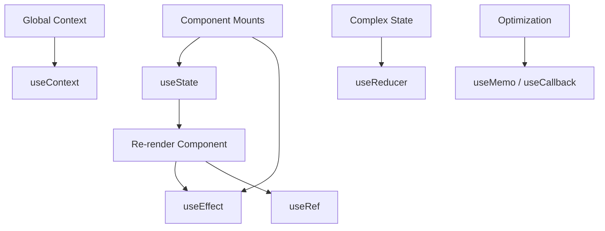
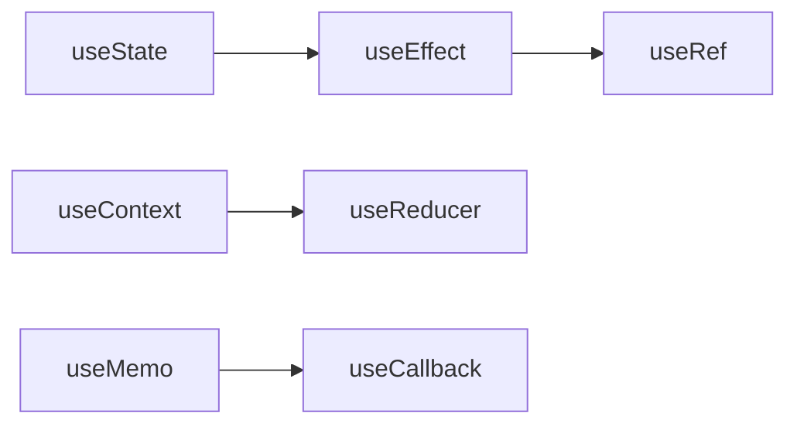
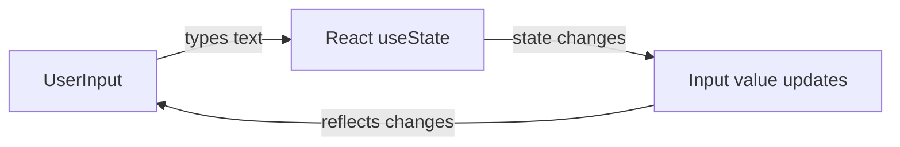

# ⚛️ ReactJS + Vite Notes

---

## 🧠 What is ReactJS?

- **ReactJS** is a **JavaScript library** used to build **User Interfaces (UI)** or **Frontends**, especially **complex** and **dynamic** ones.
- It was **developed by Meta (Facebook)** in **2013**.

---

## 💡 Why ReactJS?

### Problem (Before React):

On Facebook, to update:

- 🔔 Notification count → had to reload the page.
- 💬 Message count → had to reload the page.
- 👥 Friend request count → had to reload the page.

Reloading made the experience **slow** and **inefficient**.

---

### Solution: ReactJS

- React introduced a **Component-Based Architecture**.
- Each part of the UI (button, navbar, profile card, etc.) is treated as a **component**.
- When data changes, **only that component re-renders**, not the whole page.

---

## 🧩 Vite + React Setup

```bash
npm create vite
npm i
npm run dev
```

---

## 🏗️ File Structure

- **index.html** → Parent of `main.jsx`
- **main.jsx** → Parent of `App.jsx`
- **App.jsx** → Child component

> 💡 Remove `React.StrictMode` in `main.jsx` if not needed.

---

## 📤 Exporting Components

```jsx
const App = () => {
  return <h1>Hello React!</h1>;
};
export default App;
```

---

## ⚡ JSX (JavaScript XML)

```jsx
const App = () => {
  const name = "Rayied";
  return <h1>Hello {name}!</h1>;
};
```

---

## 🌳 Real DOM vs Virtual DOM

| Type        | Description                                                 |
| ----------- | ----------------------------------------------------------- |
| Real DOM    | Directly updates HTML and re-renders entire page            |
| Virtual DOM | React updates only the changed parts for faster performance |

---

## ⚛️ React Component Shortcut

```jsx
// rafce
const App = () => {
  return <div>Hello World</div>;
};
export default App;
```

---

## 🧠 Returning Multiple Elements

```jsx
function App() {
  return (
    <>
      <h1>Hello</h1>
      <h2>World</h2>
    </>
  );
}
```

---

## 🧹 ESLint

- Helps maintain **code quality** and **consistency**.
- Detects errors early and enforces best practices.

---

## 🧱 Unique Keys in Lists

- When rendering lists with `.map()`, each element needs a **unique `key`**.
- Keys help React track which items change, improving rendering performance.

Example:

```jsx
{
  jobOpenings.map((ele, idx) => <Card key={idx} {...ele} />);
}
```

> 💡 Use a **unique ID** instead of index when possible.

---

## 🧱 Example Components

### 🧩 App.jsx

```jsx
import Card from "./CCard";

const App = () => {
  const jobs = [
    { company: "Google", role: "Frontend Engineer", location: "Dhaka" },
    { company: "Meta", role: "Backend Developer", location: "Bangladesh" },
  ];

  return (
    <div>
      {jobs.map((job, index) => (
        <Card key={index} {...job} />
      ))}
    </div>
  );
};

export default App;
```

---

### 💼 Card.jsx

```jsx
const Card = ({ company, role, location }) => (
  <div className="card">
    <h2>{company}</h2>
    <p>{role}</p>
    <p>{location}</p>
  </div>
);

export default Card;
```

---

## 🗂️ Summary

| Concept           | Description                       |
| ----------------- | --------------------------------- |
| ReactJS           | JS library for UI (by Meta, 2013) |
| Component-Based   | Each UI part is reusable          |
| Virtual DOM       | Faster updates                    |
| JSX               | HTML + JavaScript                 |
| `npm create vite` | Creates a new Vite project        |
| `npm run dev`     | Runs local server                 |
| `rafce`           | React Arrow Function Component    |
| Fragments         | Return multiple elements          |
| ESLint            | Cleaner code                      |

---

---

## 🎨 CSS Modules & Folder Structure

### 💡 What Are CSS Modules?

CSS Modules provide **scoped styling**, ensuring styles apply only to specific components.  
They prevent class name conflicts and improve maintainability.

Example:

```jsx
import styles from "./Card.module.css";

function Card({ company, post }) {
  return (
    <div className={styles.card}>
      <h2>{company}</h2>
      <p>{post}</p>
    </div>
  );
}
```

---

### 🗂️ Folder Structure

```
src/
 ├── components/
 │   ├── Card/
 │   │   ├── Card.jsx
 │   │   └── Card.module.css
 │   ├── Navbar/
 │   │   ├── Navbar.jsx
 │   │   └── Navbar.module.css
 ├── App.jsx
 ├── main.jsx
 └── index.css
```

---

### 🚀 Why Use This Structure?

| Benefit           | Description                          |
| ----------------- | ------------------------------------ |
| 🎯 Scoped Styling | Styles apply only to their component |
| 🧩 Modular Code   | Easier to reuse and maintain         |
| ⚡ Clean Imports  | Each component manages its own CSS   |
| 🧠 Scalability    | Ideal for large projects             |
| 💬 No Conflicts   | Avoids global style overlap          |

---

## 🎨 Why Use Tailwind CSS Over Normal CSS

| Feature            | Tailwind CSS                        | Normal CSS                       |
| ------------------ | ----------------------------------- | -------------------------------- |
| ⚡ Speed           | Apply styles directly in JSX        | Requires switching between files |
| 🧩 Reusability     | Utility classes reduce duplication  | Repeated CSS rules               |
| 🎨 Consistency     | Predefined spacing, colors, fonts   | Manual consistency needed        |
| 🧠 Maintainability | Refactoring is easy                 | Needs global edits               |
| 📱 Responsive      | Built-in responsive classes         | Manual media queries             |
| 🧵 File Size       | Removes unused styles automatically | Can grow large                   |

✅ **Tailwind** = Faster, cleaner, and more scalable for modern React UIs.

---

## 🧠 When to Use Tailwind vs CSS Modules

| Use Case                 | Recommended Option |
| ------------------------ | ------------------ |
| Small / Medium Projects  | **Tailwind CSS**   |
| Large or Enterprise Apps | **CSS Modules**    |
| Component Libraries      | **CSS Modules**    |
| Prototyping              | **Tailwind CSS**   |
| Custom UI System         | **Both Together**  |

---

✅ **Key Takeaway:**  
Use **CSS Modules** for structure & maintainability, and **Tailwind CSS** for rapid, utility-based design.

---

## 🏗️ Folder Structure in React: Feature-Based vs Atomic Design

When your React project grows, **folder organization** becomes crucial for scalability and maintainability.  
Two common approaches are **Feature-Based** and **Atomic Design** structures.

---

### ⚙️ 1. Feature-Based Folder Structure

#### 🧩 Concept

Organize files **by features or functionality** instead of by type.  
Each feature folder contains **everything needed** for that specific feature — components, styles, APIs, and tests.

#### 📁 Example Structure

```
src/
 ├── features/
 │   ├── Auth/
 │   │   ├── Login.jsx
 │   │   ├── Signup.jsx
 │   │   ├── Auth.module.css
 │   │   └── authAPI.js
 │   ├── Dashboard/
 │   │   ├── Dashboard.jsx
 │   │   ├── StatsCard.jsx
 │   │   └── Dashboard.module.css
 ├── components/
 │   └── CommonButton.jsx
 ├── App.jsx
 └── main.jsx
```

#### ✅ Pros

- Logical grouping by **feature or functionality**
- Easier team collaboration — each dev can focus on one feature
- Scales well for large, production-level apps

#### ❌ Cons

- Might create **duplicate UI components**
- Less emphasis on UI hierarchy and design consistency

---

### ⚛️ 2. Atomic Design Folder Structure

#### 🧠 Concept

Based on **Brad Frost’s Atomic Design Methodology**, this structure organizes UI components by **complexity and reusability**.

#### 📁 Example Structure

```
src/
 ├── components/
 │   ├── atoms/
 │   │   ├── Button.jsx
 │   │   ├── Input.jsx
 │   │   └── Label.jsx
 │   ├── molecules/
 │   │   ├── Card.jsx
 │   │   └── FormField.jsx
 │   ├── organisms/
 │   │   ├── Navbar.jsx
 │   │   └── Footer.jsx
 │   ├── templates/
 │   │   └── Layout.jsx
 │   └── pages/
 │       ├── HomePage.jsx
 │       └── ProfilePage.jsx
 ├── App.jsx
 └── main.jsx
```

#### ✅ Pros

- Promotes **maximum component reusability**
- Follows a **clear visual hierarchy** (atoms → molecules → organisms → templates → pages)
- Perfect for **design systems and UI libraries**

#### ❌ Cons

- More **abstract** and harder for beginners to grasp
- May feel **too fragmented** for small projects

---

### 🆚 Comparison Table

| Feature         | Feature-Based                       | Atomic Design                   |
| --------------- | ----------------------------------- | ------------------------------- |
| 🧩 Organization | By functionality (Login, Dashboard) | By UI hierarchy (atoms → pages) |
| 🧠 Focus        | Business logic separation           | Reusable UI components          |
| 🚀 Scalability  | Excellent for large apps            | Excellent for design systems    |
| ⚡ Reusability  | Moderate                            | Very high                       |
| 🧑‍💻 Best for     | Product-based apps                  | UI/Design-heavy projects        |

---

### 💡 Summary

- **Feature-Based** → Best for **applications** focusing on logic and functionality.
- **Atomic Design** → Best for **component libraries** and **UI consistency**.
- Many modern React setups **combine both approaches**, using atomic design **inside each feature** for balance and scalability.
  npm install remixicon --save
  npm i lucide-react

---

## 🧠 Using Functions & Events in React

### ✅ Best Practices

- Define functions **outside JSX** to avoid re-creation on each render.
- Use **arrow functions** for concise syntax.
- Always **pass functions to events**, not call them immediately (no `()` unless intentional).

### Example: Click & Input Events

```jsx
const App = () => {
  const handleClick = () => console.log("Button clicked");
  const handleInput = (val) => console.log(val);

  return (
    <div>
      <button onClick={handleClick}>Click Me</button>
      <input
        onChange={(e) => handleInput(e.target.value)}
        placeholder="Type..."
      />
    </div>
  );
};

export default App;
```

### Example: Scroll Event

```jsx
const App = () => {
  const handleScroll = (delta) => {
    if (delta > 0) console.log("Scrolling down");
    else console.log("Scrolling up");
  };

  return (
    <div onWheel={(e) => handleScroll(e.deltaY)}>
      <div className="page1"></div>
      <div className="page2"></div>
      <div className="page3"></div>
    </div>
  );
};

export default App;
```

---

### ❌ How NOT to Use Functions

1. **Do not define heavy functions inside JSX**:

```jsx
// ❌ Bad
return (
  <button
    onClick={() => {
      console.log("Button clicked");
      // complex logic here – recreated on every render
    }}
  >
    Click Me
  </button>
);
```

2. **Do not call functions immediately on events unless intentional**:

```jsx
// ❌ Bad
<button onClick={handleClick()}>Click Me</button> // calls immediately on render
```

3. **Avoid anonymous functions for repeated or heavy operations**  
   They create new function instances each render, affecting performance for large or frequently updated components.

---

### 💡 Tips

- Always **pass the function reference** to event handlers.
- Use **parameters with arrow functions** when needed:

```jsx
<button onClick={() => handleClick("Hello")}>Click Me</button>
```

- For performance-critical components, consider **memoization** (`useCallback`) for handler functions.

---

✅ **Key Takeaway:**

- Functions in React should be **readable, reusable, and efficient**.
- Correct usage ensures **better performance, maintainability, and clarity** in your components.

<!-- ## Hooks -->

<!-- usestate-> manages states
useeffect-> sideeffect manages[without disturbing main,manage side]
mainfunction+api call and fetch data(sideeffect/process)
useref:
mutable values hold which doesnt trigger re-render
in js->doc.getelementbyid("abc");
i want to change a variable
directly change [not efficient]
ask react to change and return change[usestate]
to select a dom element using useref.

usecontext:
global context manages

app->Sect1>-sect2:
directly cannto send app to sect1.
make data global using context api anyone can access from anywhere.
usereducer: complex global state manages
[1.basic state manage:usestate
2.global state manage:usecontext
complex global state manages:usereducer]
usememo: for optimization
memoization
usecallback: for optimization
usememo,usecallback: for optimization, unnecessary re-renders avoid.
-->

<!-- usestate:
batch update: -->

# 🪝 React Hooks Complete Cheatsheet



---

## 1. `useState` – Local State

Manages local state inside a component. Each state update triggers a re-render.

```jsx
import { useState } from "react";

const App = () => {
  const [num, setNum] = useState(0);
  const [userName, setUserName] = useState("Sarthak");

  const increment = () => setNum((prev) => prev + 1);
  const decrement = () => setNum((prev) => prev - 1);
  const changeName = () => setUserName("Rayied");

  return (
    <div>
      <h1>Name: {userName}</h1>
      <h1>Value: {num}</h1>
      <button onClick={increment}>Increase</button>
      <button onClick={decrement}>Decrease</button>
      <button onClick={changeName}>Change Name</button>
    </div>
  );
};
```

**Tips:**

- Functional updates ensure correct value when multiple state updates occur.
- State should be immutable; don't modify objects or arrays directly.

---

## 2. Batch Updates

React can batch multiple state updates into a single render for performance.

```jsx
const [batchUpdate, setBatchUpdate] = useState(10);

const up = () => {
  setBatchUpdate((prev) => prev + 1);
  setBatchUpdate((prev) => prev + 1);
  setBatchUpdate((prev) => prev + 1); // increments by 3
};
```

**Note:** Using previous state inside the updater function is essential for batch increments.

---

## 3. Updating Objects & Arrays

Always create a new copy of the state to avoid mutations.

```jsx
// Object update
setUser((prev) => ({ ...prev, age: 50 }));

// Array update
setNumbers((prev) => [...prev, 97]);
```

- Spread operator (`...`) creates a shallow copy.
- Functional updates prevent stale closures.

---

# 4. useEffect -- Side Effects in React

`useEffect` is used for running side effects such as API calls,
subscriptions, DOM updates, and timers.

```jsx
import { useEffect } from "react";

useEffect(() => {
  console.log("Component mounted or num changed", num);
  return () => console.log("Cleanup before next effect or unmount");
}, [num]);
```

## 🔹 Dependency Rules

- **Empty array `[]`** → Runs **only once** (on mount).
- **No dependency array** → Runs **after every render**.

---

## 🔹 Example Comparison

### ✅ Example 1 -- with `[]`

```jsx
useEffect(() => {
  setTimeout(() => {
    setCount((count) => count + 1);
  }, 2000);
}, []);
```

✔ Runs **once** → count increases **only one time**.

---

### ✅ Example 2 -- without dependency array

```jsx
useEffect(() => {
  setTimeout(() => {
    setCount((count) => count + 1);
  }, 2000);
});
```

✔ Runs **after every render**, causing **continuous increments**
(infinite loop).

---

## 🔹 Cleanup Function

The function returned inside `useEffect` runs: - before the next effect
call - when the component unmounts

Useful for: - clearing timers - canceling subscriptions - removing event
listeners

---

## 5. `useRef` – Mutable Values / DOM Access

UseRef is a react hook that allow us to create mutable variables,which will not re-render the components.It is also used for accessing DOM elements.
Keeps a value that persists across renders without triggering re-render.

```jsx
import { useRef } from "react";

const inputRef = useRef(null);
<input ref={inputRef} />;

// Focus input
inputRef.current.focus();
```

- Useful for accessing DOM elements, storing timers, or mutable variables.
- We use useRef hook when we don't need to re-reder components when thevalue is changed/updated.

---

## 6. `useContext` – Global State

Provides a way to share state across components without prop drilling.

```jsx
import { createContext, useContext } from "react";

const MyContext = createContext();

<MyContext.Provider value={{ user: "Rayied", theme: "dark" }}>
  <Child />
</MyContext.Provider>;

const Child = () => {
  const value = useContext(MyContext);
  return (
    <p>
      User: {value.user}, Theme: {value.theme}
    </p>
  );
};
```

- Works with Provider/Consumer pattern.
- Can be combined with `useReducer` for complex global state.

---

## 7. `useReducer` – Complex State

Good for managing multiple related state values or complex logic.

```jsx
const reducer = (state, action) => {
  switch (action.type) {
    case "increment":
      return { ...state, count: state.count + 1 };
    case "decrement":
      return { ...state, count: state.count - 1 };
    default:
      return state;
  }
};

const [state, dispatch] = useReducer(reducer, { count: 0 });
<button onClick={() => dispatch({ type: "increment" })}>Add</button>;
```

- State is immutable and managed through dispatch actions.
- Makes logic predictable and testable.

---

## 8. `useMemo` & `useCallback` – Optimization

The useMemo Hook returns a memoized value.(it's like caching a value so that it doesn't need to be recalculated.)
The useMemo hook only runs when one of its dependencies gets updated.This can improve the performance of the application.There is one more hook in react to improve performance, that is useCallback hook.
The useMemo and useCallback hook are simillar.The main difference is:

- useMemo returns a memoized value.
- useCallback returns a memoized Function.
  Avoid expensive recalculations and unnecessary function re-creations.

  useCallback is a hook that lets you cache a function definiton between re-renders.
  It means,when we use the usecallback hook, it doesn't create multiple instance of same function when re-render happens.
  Instead of Creating new instance of the function, it provides the cached function on re-render of the component.

```jsx
import { useMemo, useCallback } from "react";

const memoValue = useMemo(() => computeExpensive(num), [num]);
const memoFunc = useCallback(() => doSomething(num), [num]);
```

- `useMemo` caches the result of a computation.
- `useCallback` caches the function reference.
- Reduces unnecessary re-renders in child components.

---

## 🔹 Hook Usage Flow



---

## ✅ Summary Table

| Hook          | Purpose              | Short Example                            |
| ------------- | -------------------- | ---------------------------------------- |
| `useState`    | Local state          | `[num,setNum]=useState(0)`               |
| `useEffect`   | Side effects         | `useEffect(()=>{},[dep])`                |
| `useRef`      | Mutable value / DOM  | `const ref=useRef()`                     |
| `useContext`  | Global state         | `const val=useContext(MyContext)`        |
| `useReducer`  | Complex state        | `[state,dispatch]=useReducer(reducer,0)` |
| `useMemo`     | Memoize calculations | `useMemo(()=>expensive(),[dep])`         |
| `useCallback` | Memoize functions    | `useCallback(()=>fn(),[dep])`            |

---

**Additional Tips:**

- Combine hooks (e.g., `useReducer` + `useContext`) for global complex state.
- Always clean up side-effects in `useEffect`.
- Use functional updates to prevent stale closures in `useState`.
- Optimize expensive calculations with `useMemo` and functions with `useCallback`.

# 📝 React Form Handling Cheat Sheet

## 1. Basic Form Handling

By default, submitting a form reloads the page. Example:

```jsx
const App = () => {
  const submitHandler = () => {
    console.log("Form submitted");
  };

  return (
    <form onSubmit={submitHandler}>
      <input type="text" placeholder="Enter your Name" />
      <button>Submit</button>
    </form>
  );
};
```

- Issue: Page reloads immediately after submit, so `console.log` is visible only for a moment.

---

## 2. Prevent Default Behavior

Use `e.preventDefault()` to stop page reload.

```jsx
const App = () => {
  const submitHandler = (e) => {
    e.preventDefault();
    console.log("Form submitted");
  };

  return (
    <form onSubmit={submitHandler}>
      <input type="text" placeholder="Enter your Name" />
      <button>Submit</button>
    </form>
  );
};
```

- Now the page **does not reload** and you can see console logs clearly.

---

## 3. Controlled Components

Keep form inputs in state for React-controlled forms.

```jsx
import { useState } from "react";

const App = () => {
  const [name, setName] = useState("");

  const submitHandler = (e) => {
    e.preventDefault();
    console.log(name);
  };

  return (
    <form onSubmit={submitHandler}>
      <input
        type="text"
        value={name}
        onChange={(e) => setName(e.target.value)}
        placeholder="Enter your Name"
      />
      <button>Submit</button>
    </form>
  );
};
```

- Advantage: Easy to access form values.
- Can combine multiple inputs in one state object.

---

## 4. Quick Tips

- Always use `e.preventDefault()` in React forms.
- Controlled inputs are preferred for dynamic validation or state-dependent behavior.
- For multiple inputs, use a single state object:

```jsx
const [formData, setFormData] = useState({ name: "", email: "" });
setFormData((prev) => ({ ...prev, name: e.target.value }));
```

# 🔄 React Two-Way Binding Cheat Sheet

## 1. Two-Way Binding in React

Two-way binding allows input fields to **update state** and reflect state changes in the input. This is essential for controlled forms.

```jsx
import { useState } from "react";

const App = () => {
  const [title, setTitle] = useState("");

  const submitHandler = (e) => {
    e.preventDefault(); // prevents page reload
    console.log("Form Submitted:", title);
  };

  return (
    <form onSubmit={submitHandler}>
      <input
        type="text"
        value={title}
        onChange={(e) => setTitle(e.target.value)}
        placeholder="Enter your Name"
      />
      <button>Submit</button>
    </form>
  );
};
```

**Key Points:**

- `value={title}` → input reflects the current state
- `onChange` → updates state when user types
- Prevents default form submission with `e.preventDefault()`
- Useful for **live validation** and **controlled components**

---

## 2. How It Works (Diagram)



**Explanation:**

1. User types into the input field.
2. `onChange` handler updates the state.
3. State change automatically updates the input value.
4. The loop continues, maintaining synchronization.

---

## 3. Multiple Inputs with Single State Object

```jsx
const [formData, setFormData] = useState({ name: '', email: '' });

const handleChange = (e) => {
  const { name, value } = e.target;
  setFormData(prev => ({ ...prev, [name]: value }));
};

<input name="name" value={formData.name} onChange={handleChange} />
<input name="email" value={formData.email} onChange={handleChange} />
```

- Allows multiple input fields to be managed with a **single state object**.
- Keeps the form organized and scalable.

---

## 4. Quick Tips

- Always use `e.preventDefault()` in form submissions.
- Controlled components are **reactive**, making it easier to validate or manipulate input.
- Two-way binding is essential for features like:
  - Live form validation
  - Conditional input formatting
  - Pre-filling forms with existing data
- Combine with **custom hooks** for reusable form logic.

# 💾 sessionStorage vs localStorage in JavaScript

## 1. Overview

Both **localStorage** and **sessionStorage** are part of the **Web Storage API**, allowing developers to store data in the browser in a key-value pair format. Unlike cookies, this data is **not sent to the server** with each HTTP request.

| Feature              | localStorage                                        | sessionStorage                                  |
| -------------------- | --------------------------------------------------- | ----------------------------------------------- |
| **Scope**            | Persistent storage across browser sessions          | Temporary storage for the active tab/session    |
| **Data Persistence** | Remains until explicitly deleted                    | Cleared when the tab or browser is closed       |
| **Storage Limit**    | Around 5–10 MB                                      | Around 5 MB                                     |
| **Accessibility**    | Available across all tabs with the same origin      | Available only within the same browser tab      |
| **Use Case**         | Long-term preferences, tokens, theme, user data     | Temporary data, forms, or one-time session info |
| **API Methods**      | `setItem()`, `getItem()`, `removeItem()`, `clear()` | Same methods as localStorage                    |

---

## 2. 🗂️ localStorage Example

```jsx
const App = () => {
  // ✅ Store a simple value
  localStorage.setItem("age", 25);

  // ✅ Retrieve it
  const age = localStorage.getItem("age");
  console.log(age); // 25

  // ✅ Remove a specific item
  localStorage.removeItem("age");

  // ✅ Store complex data (object)
  const user = { username: "Rayied", age: 25, city: "Gazipur" };
  localStorage.setItem("user", JSON.stringify(user));

  // ✅ Retrieve and parse it back
  const data = JSON.parse(localStorage.getItem("user"));
  console.log(data.username); // Rayied

  return <div>App</div>;
};
```

### 🔍 Notes:

- Data **remains after closing the browser**.
- Always use `JSON.stringify()` when storing objects.
- Use `JSON.parse()` to read structured data.
- Data is domain-specific; one domain cannot access another domain's storage.

---

## 3. 🕒 sessionStorage Example

```jsx
// Store temporary data during the session
sessionStorage.setItem("theme", "dark");

// Retrieve it
const theme = sessionStorage.getItem("theme");
console.log(theme); // dark

// Remove item
sessionStorage.removeItem("theme");

// Clear all session data
sessionStorage.clear();
```

### 🧠 Notes:

- Data disappears once you close the tab or browser.
- Each browser tab has its own separate sessionStorage.
- Works best for short-term data like a form-in-progress or temporary session tokens.

---

## 4. 🧩 Key Differences Summary

| Criteria          | localStorage                          | sessionStorage                    |
| ----------------- | ------------------------------------- | --------------------------------- |
| **Lifetime**      | Persistent                            | Ends with session/tab             |
| **Access Scope**  | Shared between all tabs (same origin) | Isolated per tab                  |
| **Storage Limit** | Higher (5–10 MB)                      | Slightly smaller (~5 MB)          |
| **Use Case**      | Remember user settings, theme, tokens | Temporary form data, user session |
| **Clearing Data** | Manual (`removeItem`, `clear`)        | Automatic on session end          |

---

## 5. 🚀 Practical Use Cases

### ✅ Use localStorage for:

- Saving dark/light mode preferences
- Caching API responses for offline access
- Storing JWT authentication tokens
- Keeping user language settings

### ⚡ Use sessionStorage for:

- Form data between navigation steps
- Temporary shopping cart for guest checkout
- Keeping a flag for an ongoing session process

---

## 6. ⚙️ Common Methods

| Method                | Description            | Example                                  |
| --------------------- | ---------------------- | ---------------------------------------- |
| `setItem(key, value)` | Stores data            | `localStorage.setItem('name', 'Rayied')` |
| `getItem(key)`        | Retrieves data         | `localStorage.getItem('name')`           |
| `removeItem(key)`     | Deletes a specific key | `localStorage.removeItem('name')`        |
| `clear()`             | Clears all keys        | `localStorage.clear()`                   |

---

## 7. ⚠️ Important Considerations

- Both are **synchronous APIs** — avoid using them for large data to prevent blocking the main thread.
- Data is stored as **strings only**.
- No built-in expiration — manually handle expiration logic if needed.
- Avoid storing sensitive information like passwords or tokens unless encrypted.

Example of manual expiration logic:

```js
const now = new Date();
const item = {
  value: "Rayied",
  expiry: now.getTime() + 3600000, // 1 hour
};
localStorage.setItem("user", JSON.stringify(item));

const getItem = (key) => {
  const stored = JSON.parse(localStorage.getItem(key));
  if (!stored) return null;
  if (new Date().getTime() > stored.expiry) {
    localStorage.removeItem(key);
    return null;
  }
  return stored.value;
};
```

---

## 8. 🔐 When Not to Use localStorage/sessionStorage

- For **sensitive data** (use secure cookies or server-side storage).
- For **large data** (use IndexedDB instead).
- For **multi-tab synchronization**, consider using the `storage` event:

```js
window.addEventListener("storage", (event) => {
  console.log("Storage changed:", event);
});
```

---

## 9. 🧾 Summary Table

| Use Case                | Best Option    |
| ----------------------- | -------------- |
| Long-term user data     | localStorage   |
| Temporary, per-tab data | sessionStorage |
| Cross-tab persistence   | localStorage   |
| Security-sensitive data | Avoid both     |

---

✅ **In Short:**

- `localStorage` → Long-term, persistent data
- `sessionStorage` → Temporary, tab-specific data

# 🌐 API Calling in Web Development

## 🔄 Overview

APIs (Application Programming Interfaces) enable **communication between frontend and backend**.  
They allow data to be sent, received, and manipulated across applications or services.

### 🔁 Flow of Data

1. **Frontend → API → Backend → Database**
2. **Backend → API → Frontend**

👉 The frontend sends an HTTP request to the backend (usually via an API endpoint), and the backend fetches data from the database and responds.

---

## 🧩 Methods for API Calling

### 1️⃣ Using `fetch()` (Built-in JavaScript Method)

- Available by default in browsers.
- Returns a **Promise** that resolves into a response object.
- Requires manual conversion to JSON.

```javascript
// Example: GET request using fetch()
fetch("https://api.example.com/users")
  .then((response) => response.json())
  .then((data) => console.log(data))
  .catch((error) => console.error("Error:", error));
```

```javascript
// Example: POST request using fetch()
fetch("https://api.example.com/add-user", {
  method: "POST",
  headers: { "Content-Type": "application/json" },
  body: JSON.stringify({ name: "Rayied", age: 25 }),
})
  .then((res) => res.json())
  .then((data) => console.log("User added:", data))
  .catch((err) => console.error(err));
```

🧠 **Tips:**

- Always handle `.catch()` for error handling.
- Use `async/await` for cleaner and more readable code.

```javascript
// Example with async/await
async function getData() {
  try {
    const res = await fetch("https://api.example.com/data");
    const data = await res.json();
    console.log(data);
  } catch (error) {
    console.error(error);
  }
}
getData();
```

---

### 2️⃣ Using `axios()` (External Library)

- Simplifies syntax and provides better error handling.
- Automatically converts JSON data.
- Supports interceptors, cancellation, and timeout.
- Works in both browser and Node.js environments.

📦 **Install axios:**

```bash
npm install axios
```

```javascript
import axios from "axios";

// Example: GET request using axios
axios
  .get("https://api.example.com/users")
  .then((res) => console.log(res.data))
  .catch((err) => console.error(err));
```

```javascript
// Example: POST request using axios
axios
  .post("https://api.example.com/add-user", {
    name: "Rayied",
    age: 25,
  })
  .then((res) => console.log("User added:", res.data))
  .catch((err) => console.error("Error:", err));
```

🧠 **Advantages of axios:**

- Supports interceptors (useful for authentication tokens).
- Handles JSON automatically.
- Supports request cancellation and timeout configuration.

```javascript
// Example with async/await
async function fetchData() {
  try {
    const res = await axios.get("https://api.example.com/info");
    console.log(res.data);
  } catch (error) {
    console.error("Error fetching data:", error);
  }
}
fetchData();
```

---

## ⚖️ Comparison Table

| Feature         | fetch()    | axios()                  |
| --------------- | ---------- | ------------------------ |
| Built-in        | ✅ Yes     | ❌ No (requires install) |
| JSON Conversion | ❌ Manual  | ✅ Automatic             |
| Interceptors    | ❌ No      | ✅ Yes                   |
| Error Handling  | Basic      | Advanced                 |
| Node.js Support | ⚠️ Limited | ✅ Full                  |

---

## 🧠 Best Practices

- Handle errors using `try/catch` or `.catch()` always.
- Store API URLs in environment variables.
- Separate API calls into a dedicated file (e.g., `api.js`).
- Secure sensitive data like API keys using environment variables.
- Use `axios.interceptors` for adding authorization headers.

```javascript
// Example: Using interceptor in axios
axios.interceptors.request.use((config) => {
  config.headers.Authorization = `Bearer ${localStorage.getItem("token")}`;
  return config;
});
```

---

## 🧩 Example Flow Summary (Frontend + Backend)

**Frontend (React)** → sends request via `fetch()` or `axios()` →  
**Backend (Node.js/Express)** → processes request and fetches data from **Database** →  
Returns data → displayed in **Frontend UI**.

---

## ⚙️ React Example with `fetch()` and `axios()`

```javascript
import axios from "axios";
import { useState } from "react";

const App = () => {
  const [data, setData] = useState([]);

  const getDataAxios = async () => {
    const res = await axios.get("https://picsum.photos/v2/list");
    setData(res.data);
  };

  const getDataFetch = async () => {
    const response = await fetch("https://jsonplaceholder.typicode.com/users");
    const data = await response.json();
    console.log(data);
  };

  return (
    <div>
      <button onClick={getDataFetch}>Get Data Fetch</button>
      <button onClick={getDataAxios}>Get Data Axios</button>
      <div>
        {data.map((ele, idx) => (
          <h3 key={idx}>
            Hello, {ele.author}, {idx + 1}
          </h3>
        ))}
      </div>
    </div>
  );
};

export default App;
```

---

## 💡 Extra Notes

- Use **React Query** or **SWR** for automatic caching, refetching, and state management for APIs.
- In large projects, create an `apiClient.js` file to centralize all axios configurations.
- Always validate data on both backend and frontend.
- Avoid hardcoding URLs — use `.env` variables instead.

---

📘 _Quick Tip:_  
Use `axios` for complex projects with authentication, multiple API calls, or advanced error handling.  
Use `fetch` for simple or lightweight projects.

---

© 2025 — **API Calling Guide by Rayied**

# React: useEffect, Lazy Loading, Infinite Scrolling, and Routing

This document explains key React features with clear examples and best practices. It includes: `useEffect` (with dependency and cleanup logic), image lazy loading, infinite scrolling, and `react-router-dom` routing (BrowserRouter, HashRouter, MemoryRouter, nested & dynamic routes). Copy the examples directly into your project.

---

## Table of Contents

1. [useEffect basics](#useeffect-basics)
2. [useEffect dependencies & cleanup](#useeffect-dependencies--cleanup)
3. [Practical useEffect examples](#practical-useeffect-examples)
4. [Image lazy loading techniques](#image-lazy-loading-techniques)
5. [Infinite scrolling pattern](#infinite-scrolling-pattern)
6. [React Router (react-router-dom) — installation & concepts](#react-router-react-router-dom)
7. [BrowserRouter vs HashRouter vs MemoryRouter vs StaticRouter](#router-types)
8. [Links, navigation, preventing reloads](#links-and-preventing-reloads)
9. [Nested routes & dynamic routes](#nested-and-dynamic-routes)
10. [useParams, useNavigate, 404 handling](#useparams-usenavigate-404)
11. [Full small example project structure & notes]

---

## useEffect basics

`useEffect` runs side-effects in function components. Side-effects include: data fetching, subscriptions, timers, DOM mutations, manual event listeners.

```jsx
import React, { useEffect, useState } from "react";

function Example() {
  const [count, setCount] = useState(0);

  // runs after every render (mount and update)
  useEffect(() => {
    console.log("Effect ran: count is", count);
  });

  return (
    <div>
      <p>{count}</p>
      <button onClick={() => setCount((c) => c + 1)}>Increment</button>
    </div>
  );
}
```

**Important:** If you pass no dependency array (as above), the effect runs after every render. This can be expensive.

---

## useEffect dependencies & cleanup

`useEffect` accepts a second argument — the dependency array. It controls when the effect runs:

- `[]` — run once after the first render (componentDidMount equivalent).
- `[a, b]` — run after the first render and whenever `a` or `b` change.
- **No array** — run after every render.

### Cleanup function

Return a cleanup function from the effect to clean subscriptions, timers, or listeners. Cleanup runs before the effect re-runs and when the component unmounts.

```jsx
useEffect(() => {
  const id = setInterval(() => {
    console.log("tick");
  }, 1000);

  return () => {
    clearInterval(id); // cleanup when dependencies change or unmount
  };
}, []); // runs once
```

---

## Practical useEffect examples

### Example 1 — Run effect only when a specific state variable changes

```jsx
import React, { useEffect, useState } from "react";

export default function App() {
  const [num, setNum] = useState(0);
  const [num2, setNum2] = useState(100);

  useEffect(() => {
    console.log("useEffect running because num changed:", num);
  }, [num]); // only runs when `num` changes

  return (
    <div>
      <h1> num is {num}</h1>
      <h1> num2 is {num2}</h1>
      <button
        onMouseEnter={() => setNum((n) => n + 1)}
        onMouseLeave={() => setNum2((n) => n + 10)}
      >
        Hover
      </button>
    </div>
  );
}
```

### Example 2 — Fetch data once on mount

```jsx
useEffect(() => {
  let mounted = true;
  async function load() {
    const res = await fetch("/api/items");
    const data = await res.json();
    if (mounted) setItems(data);
  }
  load();
  return () => {
    mounted = false;
  };
}, []);
```

This pattern prevents state updates after unmount.

---

## Image lazy loading techniques

### 1. Native browser lazy loading

Use `loading="lazy"` on `` — simplest and supported in modern browsers.

```jsx

```

### 2. React `loading` placeholder + `IntersectionObserver`

Use an `IntersectionObserver` to swap in the real `src` when the image enters the viewport.

```jsx
import React, { useRef, useEffect, useState } from "react";

function LazyImage({ src, alt, placeholder }) {
  const ref = useRef();
  const [visible, setVisible] = useState(false);

  useEffect(() => {
    if (!ref.current) return;
    const obs = new IntersectionObserver((entries) => {
      entries.forEach((entry) => {
        if (entry.isIntersecting) {
          setVisible(true);
          obs.disconnect();
        }
      });
    });
    obs.observe(ref.current);
    return () => obs.disconnect();
  }, []);

  return (
    
  );
}
```

### 3. React libraries

Use `react-lazyload`, `react-intersection-observer`, or `lazysizes` for more features like placeholders, fade-in, and responsive image loading.

---

## Infinite scrolling pattern

Infinite scrolling loads more items as the user scrolls near the bottom. Two common approaches:

1. Listen to `scroll` and check position (older, less efficient).
2. Use `IntersectionObserver` on a sentinel element (recommended).

### Example: Infinite scroll with IntersectionObserver

```jsx
import React, { useEffect, useRef, useState } from "react";

function InfiniteList({ fetchPage }) {
  const [items, setItems] = useState([]);
  const [page, setPage] = useState(1);
  const [hasMore, setHasMore] = useState(true);
  const loaderRef = useRef(null);

  useEffect(() => {
    let mounted = true;
    fetchPage(page).then(({ data, more }) => {
      if (!mounted) return;
      setItems((prev) => [...prev, ...data]);
      setHasMore(more);
    });
    return () => {
      mounted = false;
    };
  }, [page]);

  useEffect(() => {
    const observer = new IntersectionObserver(
      (entries) => {
        const first = entries[0];
        if (first.isIntersecting && hasMore) {
          setPage((p) => p + 1);
        }
      },
      { threshold: 1 }
    );

    const current = loaderRef.current;
    if (current) observer.observe(current);
    return () => observer.disconnect();
  }, [hasMore]);

  return (
    <div>
      {items.map((it, i) => (
        <div key={i}>{it.title}</div>
      ))}
      <div ref={loaderRef} style={{ height: 1 }} />
      {!hasMore && <p>No more items</p>}
    </div>
  );
}

export default InfiniteList;
```

**Tips:** debounce API calls, show skeleton loaders, handle errors, and use page size limits.

---

## React Router (react-router-dom)

### Install

```bash
npm install react-router-dom@6
# or
yarn add react-router-dom@6
```

> We use v6+ syntax (hooks-based): `Routes`, `Route`, `Navigate`, `useParams`, `useNavigate`.

### Basic setup (BrowserRouter)

```jsx
import { BrowserRouter, Routes, Route } from "react-router-dom";
import Home from "./pages/Home";
import About from "./pages/About";
import Courses from "./pages/Courses";

function App() {
  return (
    <BrowserRouter>
      <Routes>
        <Route path="/" element={<Home />} />
        <Route path="/about" element={<About />} />
        <Route path="/courses" element={<Courses />} />
      </Routes>
    </BrowserRouter>
  );
}
```

---

## BrowserRouter vs HashRouter vs MemoryRouter vs StaticRouter

- **BrowserRouter**: uses HTML5 history API. Good for normal web apps served by a server configured to return `index.html` for unknown routes.
- **HashRouter**: uses hash portion (`/#/path`) and does not send route info to the server; good for static hosting without server-side fallback.
- **MemoryRouter**: stores location in memory; useful for tests or non-DOM environments.
- **StaticRouter**: used for server-side rendering (example: Next.js internal routing uses a different mechanism).

Example of HashRouter:

```jsx
import { HashRouter, Routes, Route } from "react-router-dom";

<HashRouter>
  <Routes>
    <Route path="/" element={<Home />} />
  </Routes>
</HashRouter>;
```

---

## Links and preventing full-page reloads

Use `Link` (or `NavLink`) from `react-router-dom` instead of `<a>` to navigate client-side without reloading:

```jsx
import { Link } from "react-router-dom";

<Link to="/courses">Courses</Link>;
```

`NavLink` provides `active` styling utilities.

---

## Nested routes & dynamic routes

### Nested routes example

Folder structure:

```
/src/pages/
  Courses/
    index.jsx         // shows list
    CourseDetails.jsx // shows one course
```

Routes:

```jsx
<Routes>
  <Route path="/courses" element={<CoursesLayout />}>
    <Route index element={<CoursesList />} />
    <Route path=":id" element={<CourseDetails />} />
  </Route>
</Routes>
```

Where `CoursesLayout` renders an `<Outlet />` to show nested children.

### Dynamic routes

`/courses/:id` — `:id` is a parameter you can read with `useParams()`.

```jsx
import { useParams } from "react-router-dom";

function CourseDetails() {
  const { id } = useParams();
  // fetch course by id
}
```

---

## useParams, useNavigate, and 404 handling

- `useParams()` — read route params.
- `useNavigate()` — programmatic navigation (like redirect after login).
- `Navigate` component — declarative redirect.

Example: redirect after form submit

```jsx
import { useNavigate } from "react-router-dom";

function Register() {
  const navigate = useNavigate();
  async function onSubmit(data) {
    await api.register(data);
    navigate("/login");
  }
}
```

404 page — match all unmatched routes with `path="*"`:

```jsx
<Routes>
  {/* other routes */}
  <Route path="*" element={<NotFound />} />
</Routes>
```

---

## Example: Small project wiring

```
src/
  App.jsx
  index.jsx
  pages/
    Home.jsx
    Courses/
      index.jsx
      CourseDetails.jsx
    NotFound.jsx
```

`index.jsx`:

```jsx
import React from "react";
import { createRoot } from "react-dom/client";
import App from "./App";

createRoot(document.getElementById("root")).render(<App />);
```

`App.jsx`:

```jsx
import { BrowserRouter, Routes, Route } from "react-router-dom";
import Home from "./pages/Home";
import Courses from "./pages/Courses";
import CourseDetails from "./pages/Courses/CourseDetails";
import NotFound from "./pages/NotFound";

export default function App() {
  return (
    <BrowserRouter>
      <Routes>
        <Route path="/" element={<Home />} />
        <Route path="/courses" element={<Courses />} />
        <Route path="/courses/:id" element={<CourseDetails />} />
        <Route path="*" element={<NotFound />} />
      </Routes>
    </BrowserRouter>
  );
}
```

---

## Notes, pitfalls & best practices

- Always add dependency arrays to `useEffect` to avoid unwanted runs.
- Prefer `IntersectionObserver` over `scroll` events for performance.
- Cancel async calls in effects (mounted flag or AbortController) to avoid setting state on unmounted components.
- Use `React.lazy` + `Suspense` for code-splitting components (not for data loading).

Example of code splitting:

```jsx
import React, { Suspense } from "react";
const Heavy = React.lazy(() => import("./Heavy"));

function App() {
  return (
    <Suspense fallback={<div>Loading...</div>}>
      <Heavy />
    </Suspense>
  );
}
```

---

# React Context API Example

This document explains **Context API in React** with a working example and a diagram.

---

## Context API Overview

- Data normally flows **top → bottom** (App → Navbar → Sidebar → UserProfile → Username)
- **Cannot flow bottom → top** easily without prop drilling
- Context API allows **centralized data** accessible by any component
- Useful for: theme, authentication, subscription info, settings, etc.

### Key Concepts

1. **Context**: Create a shared context
2. **Provider**: Provides the data to all children components
3. **useContext**: Allows any child component to consume the context

---

## Prop as Children Example

### App.jsx

```jsx
import { useState } from "react";
import Navbar from "./components/Navbar";

const App = () => {
  const [theme, setTheme] = useState("light");

  return (
    <div>
      <Navbar theme={theme}>
        <h2>This is Navbar</h2>
        <h2>Good Navbar</h2>
      </Navbar>
    </div>
  );
};

export default App;
```

### Navbar.jsx

```jsx
import Nav2 from "./Nav2";

const Navbar = ({ children, theme }) => {
  return (
    <div className="nav">
      <h2>Navbar</h2>
      {children}
      <Nav2 theme={theme} />
    </div>
  );
};

export default Navbar;
```

---

## Context API in Action

### main.jsx

```jsx
import { createRoot } from "react-dom/client";
import App from "./App.jsx";
import ThemeContext from "./Context/ThemeContext.jsx";
import "./index.css";

createRoot(document.getElementById("root")).render(
  <ThemeContext>
    <App />
  </ThemeContext>
);
```

### ThemeContext.jsx

```jsx
import { createContext, useState } from "react";

export const ThemeDataContext = createContext();

const ThemeContext = (props) => {
  const [theme, setTheme] = useState("light");

  return (
    <ThemeDataContext.Provider value={[theme, setTheme]}>
      {props.children}
    </ThemeDataContext.Provider>
  );
};

export default ThemeContext;
```

### Navbar.jsx

```jsx
import { useContext } from "react";
import { ThemeDataContext } from "../Context/ThemeContext";
import Nav2 from "./Nav2";

const Navbar = () => {
  const [theme] = useContext(ThemeDataContext);
  return (
    <div className={theme}>
      <h2>This is Navbar</h2>
      <Nav2 />
    </div>
  );
};

export default Navbar;
```

### Nav2.jsx

```jsx
import { useContext } from "react";
import { ThemeDataContext } from "../Context/ThemeContext";

const Nav2 = () => {
  const [theme] = useContext(ThemeDataContext);
  return (
    <div className="nav2">
      <h4>Home</h4>
      <h4>About</h4>
      <h4>Contact</h4>
      <h4>Services</h4>
      <h4>{theme}</h4>
    </div>
  );
};

export default Nav2;
```

### Button.jsx

```jsx
import { useContext } from "react";
import { ThemeDataContext } from "../Context/ThemeContext";

const Button = () => {
  const [theme, setTheme] = useContext(ThemeDataContext);

  const changeTheme = () => {
    setTheme(theme === "light" ? "dark" : "light");
  };

  return (
    <div>
      <button onClick={changeTheme}>Change Theme {theme}</button>
    </div>
  );
};

export default Button;
```

---

## Diagram — Context Flow

```
       ThemeContext (Provider)
               │
       ┌───────┴────────┐
       │                │
     Navbar           Button
       │
     Nav2
```

- Any component inside `ThemeContext.Provider` can **access and modify theme** using `useContext`.
- Changing theme in `Button` updates all components automatically.

---

## Summary

- **Context API centralizes data**
- Avoids **prop drilling**
- Use for **theme, auth, subscriptions, settings**
- Components: `createContext`, `Provider`, `useContext`

---

What is hooks:
Hooks are special functions that allow us to use state and other react features in functional components
