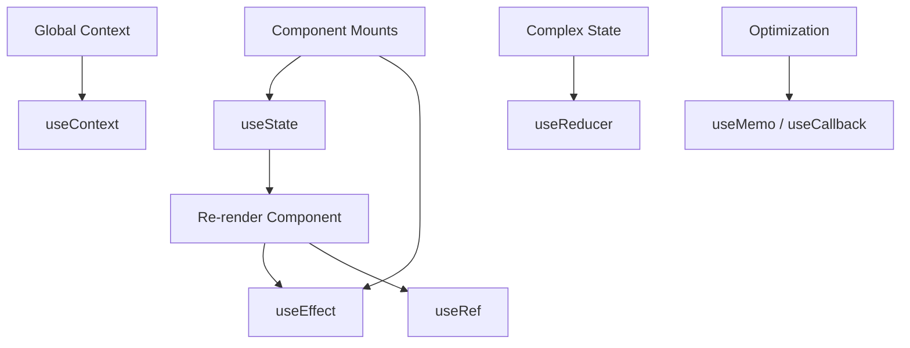
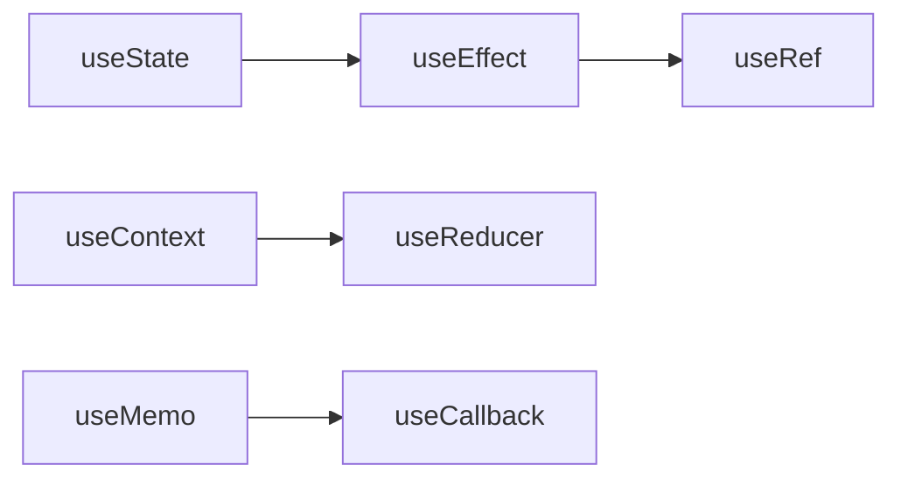
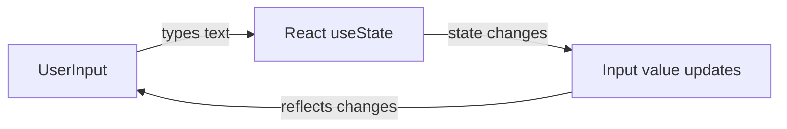

# ⚛️ ReactJS + Vite Notes

---

## 🧠 What is ReactJS?

- **ReactJS** is a **JavaScript library** used to build **User Interfaces (UI)** or **Frontends**, especially **complex** and **dynamic** ones.
- It was **developed by Meta (Facebook)** in **2013**.

---

## 💡 Why ReactJS?

### Problem (Before React):

On Facebook, to update:

- 🔔 Notification count → had to reload the page.
- 💬 Message count → had to reload the page.
- 👥 Friend request count → had to reload the page.

Reloading made the experience **slow** and **inefficient**.

---

### Solution: ReactJS

- React introduced a **Component-Based Architecture**.
- Each part of the UI (button, navbar, profile card, etc.) is treated as a **component**.
- When data changes, **only that component re-renders**, not the whole page.

---

## 🧩 Vite + React Setup

```bash
npm create vite
npm i
npm run dev
```

---

## 🏗️ File Structure

- **index.html** → Parent of `main.jsx`
- **main.jsx** → Parent of `App.jsx`
- **App.jsx** → Child component

> 💡 Remove `React.StrictMode` in `main.jsx` if not needed.

---

## 📤 Exporting Components

```jsx
const App = () => {
  return <h1>Hello React!</h1>;
};
export default App;
```

---

## ⚡ JSX (JavaScript XML)

```jsx
const App = () => {
  const name = "Rayied";
  return <h1>Hello {name}!</h1>;
};
```

---

## 🌳 Real DOM vs Virtual DOM

| Type        | Description                                                 |
| ----------- | ----------------------------------------------------------- |
| Real DOM    | Directly updates HTML and re-renders entire page            |
| Virtual DOM | React updates only the changed parts for faster performance |

---

## ⚛️ React Component Shortcut

```jsx
// rafce
const App = () => {
  return <div>Hello World</div>;
};
export default App;
```

---

## 🧠 Returning Multiple Elements

```jsx
function App() {
  return (
    <>
      <h1>Hello</h1>
      <h2>World</h2>
    </>
  );
}
```

---

## 🧹 ESLint

- Helps maintain **code quality** and **consistency**.
- Detects errors early and enforces best practices.

---

## 🧱 Unique Keys in Lists

- When rendering lists with `.map()`, each element needs a **unique `key`**.
- Keys help React track which items change, improving rendering performance.

Example:

```jsx
{
  jobOpenings.map((ele, idx) => <Card key={idx} {...ele} />);
}
```

> 💡 Use a **unique ID** instead of index when possible.

---

## 🧱 Example Components

### 🧩 App.jsx

```jsx
import Card from "./CCard";

const App = () => {
  const jobs = [
    { company: "Google", role: "Frontend Engineer", location: "Dhaka" },
    { company: "Meta", role: "Backend Developer", location: "Bangladesh" },
  ];

  return (
    <div>
      {jobs.map((job, index) => (
        <Card key={index} {...job} />
      ))}
    </div>
  );
};

export default App;
```

---

### 💼 Card.jsx

```jsx
const Card = ({ company, role, location }) => (
  <div className="card">
    <h2>{company}</h2>
    <p>{role}</p>
    <p>{location}</p>
  </div>
);

export default Card;
```

---

## 🗂️ Summary

| Concept           | Description                       |
| ----------------- | --------------------------------- |
| ReactJS           | JS library for UI (by Meta, 2013) |
| Component-Based   | Each UI part is reusable          |
| Virtual DOM       | Faster updates                    |
| JSX               | HTML + JavaScript                 |
| `npm create vite` | Creates a new Vite project        |
| `npm run dev`     | Runs local server                 |
| `rafce`           | React Arrow Function Component    |
| Fragments         | Return multiple elements          |
| ESLint            | Cleaner code                      |

---

---

## 🎨 CSS Modules & Folder Structure

### 💡 What Are CSS Modules?

CSS Modules provide **scoped styling**, ensuring styles apply only to specific components.  
They prevent class name conflicts and improve maintainability.

Example:

```jsx
import styles from "./Card.module.css";

function Card({ company, post }) {
  return (
    <div className={styles.card}>
      <h2>{company}</h2>
      <p>{post}</p>
    </div>
  );
}
```

---

### 🗂️ Folder Structure

```
src/
 ├── components/
 │   ├── Card/
 │   │   ├── Card.jsx
 │   │   └── Card.module.css
 │   ├── Navbar/
 │   │   ├── Navbar.jsx
 │   │   └── Navbar.module.css
 ├── App.jsx
 ├── main.jsx
 └── index.css
```

---

### 🚀 Why Use This Structure?

| Benefit           | Description                          |
| ----------------- | ------------------------------------ |
| 🎯 Scoped Styling | Styles apply only to their component |
| 🧩 Modular Code   | Easier to reuse and maintain         |
| ⚡ Clean Imports  | Each component manages its own CSS   |
| 🧠 Scalability    | Ideal for large projects             |
| 💬 No Conflicts   | Avoids global style overlap          |

---

## 🎨 Why Use Tailwind CSS Over Normal CSS

| Feature            | Tailwind CSS                        | Normal CSS                       |
| ------------------ | ----------------------------------- | -------------------------------- |
| ⚡ Speed           | Apply styles directly in JSX        | Requires switching between files |
| 🧩 Reusability     | Utility classes reduce duplication  | Repeated CSS rules               |
| 🎨 Consistency     | Predefined spacing, colors, fonts   | Manual consistency needed        |
| 🧠 Maintainability | Refactoring is easy                 | Needs global edits               |
| 📱 Responsive      | Built-in responsive classes         | Manual media queries             |
| 🧵 File Size       | Removes unused styles automatically | Can grow large                   |

✅ **Tailwind** = Faster, cleaner, and more scalable for modern React UIs.

---

## 🧠 When to Use Tailwind vs CSS Modules

| Use Case                 | Recommended Option |
| ------------------------ | ------------------ |
| Small / Medium Projects  | **Tailwind CSS**   |
| Large or Enterprise Apps | **CSS Modules**    |
| Component Libraries      | **CSS Modules**    |
| Prototyping              | **Tailwind CSS**   |
| Custom UI System         | **Both Together**  |

---

✅ **Key Takeaway:**  
Use **CSS Modules** for structure & maintainability, and **Tailwind CSS** for rapid, utility-based design.

---

## 🏗️ Folder Structure in React: Feature-Based vs Atomic Design

When your React project grows, **folder organization** becomes crucial for scalability and maintainability.  
Two common approaches are **Feature-Based** and **Atomic Design** structures.

---

### ⚙️ 1. Feature-Based Folder Structure

#### 🧩 Concept

Organize files **by features or functionality** instead of by type.  
Each feature folder contains **everything needed** for that specific feature — components, styles, APIs, and tests.

#### 📁 Example Structure

```
src/
 ├── features/
 │   ├── Auth/
 │   │   ├── Login.jsx
 │   │   ├── Signup.jsx
 │   │   ├── Auth.module.css
 │   │   └── authAPI.js
 │   ├── Dashboard/
 │   │   ├── Dashboard.jsx
 │   │   ├── StatsCard.jsx
 │   │   └── Dashboard.module.css
 ├── components/
 │   └── CommonButton.jsx
 ├── App.jsx
 └── main.jsx
```

#### ✅ Pros

- Logical grouping by **feature or functionality**
- Easier team collaboration — each dev can focus on one feature
- Scales well for large, production-level apps

#### ❌ Cons

- Might create **duplicate UI components**
- Less emphasis on UI hierarchy and design consistency

---

### ⚛️ 2. Atomic Design Folder Structure

#### 🧠 Concept

Based on **Brad Frost’s Atomic Design Methodology**, this structure organizes UI components by **complexity and reusability**.

#### 📁 Example Structure

```
src/
 ├── components/
 │   ├── atoms/
 │   │   ├── Button.jsx
 │   │   ├── Input.jsx
 │   │   └── Label.jsx
 │   ├── molecules/
 │   │   ├── Card.jsx
 │   │   └── FormField.jsx
 │   ├── organisms/
 │   │   ├── Navbar.jsx
 │   │   └── Footer.jsx
 │   ├── templates/
 │   │   └── Layout.jsx
 │   └── pages/
 │       ├── HomePage.jsx
 │       └── ProfilePage.jsx
 ├── App.jsx
 └── main.jsx
```

#### ✅ Pros

- Promotes **maximum component reusability**
- Follows a **clear visual hierarchy** (atoms → molecules → organisms → templates → pages)
- Perfect for **design systems and UI libraries**

#### ❌ Cons

- More **abstract** and harder for beginners to grasp
- May feel **too fragmented** for small projects

---

### 🆚 Comparison Table

| Feature         | Feature-Based                       | Atomic Design                   |
| --------------- | ----------------------------------- | ------------------------------- |
| 🧩 Organization | By functionality (Login, Dashboard) | By UI hierarchy (atoms → pages) |
| 🧠 Focus        | Business logic separation           | Reusable UI components          |
| 🚀 Scalability  | Excellent for large apps            | Excellent for design systems    |
| ⚡ Reusability  | Moderate                            | Very high                       |
| 🧑‍💻 Best for     | Product-based apps                  | UI/Design-heavy projects        |

---

### 💡 Summary

- **Feature-Based** → Best for **applications** focusing on logic and functionality.
- **Atomic Design** → Best for **component libraries** and **UI consistency**.
- Many modern React setups **combine both approaches**, using atomic design **inside each feature** for balance and scalability.
  npm install remixicon --save
  npm i lucide-react

---

## 🧠 Using Functions & Events in React

### ✅ Best Practices

- Define functions **outside JSX** to avoid re-creation on each render.
- Use **arrow functions** for concise syntax.
- Always **pass functions to events**, not call them immediately (no `()` unless intentional).

### Example: Click & Input Events

```jsx
const App = () => {
  const handleClick = () => console.log("Button clicked");
  const handleInput = (val) => console.log(val);

  return (
    <div>
      <button onClick={handleClick}>Click Me</button>
      <input
        onChange={(e) => handleInput(e.target.value)}
        placeholder="Type..."
      />
    </div>
  );
};

export default App;
```

### Example: Scroll Event

```jsx
const App = () => {
  const handleScroll = (delta) => {
    if (delta > 0) console.log("Scrolling down");
    else console.log("Scrolling up");
  };

  return (
    <div onWheel={(e) => handleScroll(e.deltaY)}>
      <div className="page1"></div>
      <div className="page2"></div>
      <div className="page3"></div>
    </div>
  );
};

export default App;
```

---

### ❌ How NOT to Use Functions

1. **Do not define heavy functions inside JSX**:

```jsx
// ❌ Bad
return (
  <button
    onClick={() => {
      console.log("Button clicked");
      // complex logic here – recreated on every render
    }}
  >
    Click Me
  </button>
);
```

2. **Do not call functions immediately on events unless intentional**:

```jsx
// ❌ Bad
<button onClick={handleClick()}>Click Me</button> // calls immediately on render
```

3. **Avoid anonymous functions for repeated or heavy operations**  
   They create new function instances each render, affecting performance for large or frequently updated components.

---

### 💡 Tips

- Always **pass the function reference** to event handlers.
- Use **parameters with arrow functions** when needed:

```jsx
<button onClick={() => handleClick("Hello")}>Click Me</button>
```

- For performance-critical components, consider **memoization** (`useCallback`) for handler functions.

---

✅ **Key Takeaway:**

- Functions in React should be **readable, reusable, and efficient**.
- Correct usage ensures **better performance, maintainability, and clarity** in your components.

<!-- ## Hooks -->

<!-- usestate-> manages states
useeffect-> sideeffect manages[without disturbing main,manage side]
mainfunction+api call and fetch data(sideeffect/process)
useref:
mutable values hold which doesnt trigger re-render
in js->doc.getelementbyid("abc");
i want to change a variable
directly change [not efficient]
ask react to change and return change[usestate]
to select a dom element using useref.

usecontext:
global context manages

app->Sect1>-sect2:
directly cannto send app to sect1.
make data global using context api anyone can access from anywhere.
usereducer: complex global state manages
[1.basic state manage:usestate
2.global state manage:usecontext
complex global state manages:usereducer]
usememo: for optimization
memoization
usecallback: for optimization
usememo,usecallback: for optimization, unnecessary re-renders avoid.
-->

<!-- usestate:
batch update: -->

# 🪝 React Hooks Complete Cheatsheet



---

## 1. `useState` – Local State

Manages local state inside a component. Each state update triggers a re-render.

```jsx
import { useState } from "react";

const App = () => {
  const [num, setNum] = useState(0);
  const [userName, setUserName] = useState("Sarthak");

  const increment = () => setNum((prev) => prev + 1);
  const decrement = () => setNum((prev) => prev - 1);
  const changeName = () => setUserName("Rayied");

  return (
    <div>
      <h1>Name: {userName}</h1>
      <h1>Value: {num}</h1>
      <button onClick={increment}>Increase</button>
      <button onClick={decrement}>Decrease</button>
      <button onClick={changeName}>Change Name</button>
    </div>
  );
};
```

**Tips:**

- Functional updates ensure correct value when multiple state updates occur.
- State should be immutable; don't modify objects or arrays directly.

---

## 2. Batch Updates

React can batch multiple state updates into a single render for performance.

```jsx
const [batchUpdate, setBatchUpdate] = useState(10);

const up = () => {
  setBatchUpdate((prev) => prev + 1);
  setBatchUpdate((prev) => prev + 1);
  setBatchUpdate((prev) => prev + 1); // increments by 3
};
```

**Note:** Using previous state inside the updater function is essential for batch increments.

---

## 3. Updating Objects & Arrays

Always create a new copy of the state to avoid mutations.

```jsx
// Object update
setUser((prev) => ({ ...prev, age: 50 }));

// Array update
setNumbers((prev) => [...prev, 97]);
```

- Spread operator (`...`) creates a shallow copy.
- Functional updates prevent stale closures.

---

## 4. `useEffect` – Side Effects

Used for API calls, subscriptions, DOM updates, timers.

```jsx
import { useEffect } from "react";

useEffect(() => {
  console.log("Component mounted or num changed", num);
  return () => console.log("Cleanup before next effect or unmount");
}, [num]);
```

- Empty array `[]` → runs only on mount.
- No dependency array → runs on every render.
- Return a function to handle cleanup.

---

## 5. `useRef` – Mutable Values / DOM Access

Keeps a value that persists across renders without triggering re-render.

```jsx
import { useRef } from "react";

const inputRef = useRef(null);
<input ref={inputRef} />;

// Focus input
inputRef.current.focus();
```

- Useful for accessing DOM elements, storing timers, or mutable variables.

---

## 6. `useContext` – Global State

Provides a way to share state across components without prop drilling.

```jsx
import { createContext, useContext } from "react";

const MyContext = createContext();

<MyContext.Provider value={{ user: "Rayied", theme: "dark" }}>
  <Child />
</MyContext.Provider>;

const Child = () => {
  const value = useContext(MyContext);
  return (
    <p>
      User: {value.user}, Theme: {value.theme}
    </p>
  );
};
```

- Works with Provider/Consumer pattern.
- Can be combined with `useReducer` for complex global state.

---

## 7. `useReducer` – Complex State

Good for managing multiple related state values or complex logic.

```jsx
const reducer = (state, action) => {
  switch (action.type) {
    case "increment":
      return { ...state, count: state.count + 1 };
    case "decrement":
      return { ...state, count: state.count - 1 };
    default:
      return state;
  }
};

const [state, dispatch] = useReducer(reducer, { count: 0 });
<button onClick={() => dispatch({ type: "increment" })}>Add</button>;
```

- State is immutable and managed through dispatch actions.
- Makes logic predictable and testable.

---

## 8. `useMemo` & `useCallback` – Optimization

Avoid expensive recalculations and unnecessary function re-creations.

```jsx
import { useMemo, useCallback } from "react";

const memoValue = useMemo(() => computeExpensive(num), [num]);
const memoFunc = useCallback(() => doSomething(num), [num]);
```

- `useMemo` caches the result of a computation.
- `useCallback` caches the function reference.
- Reduces unnecessary re-renders in child components.

---

## 🔹 Hook Usage Flow



---

## ✅ Summary Table

| Hook          | Purpose              | Short Example                            |
| ------------- | -------------------- | ---------------------------------------- |
| `useState`    | Local state          | `[num,setNum]=useState(0)`               |
| `useEffect`   | Side effects         | `useEffect(()=>{},[dep])`                |
| `useRef`      | Mutable value / DOM  | `const ref=useRef()`                     |
| `useContext`  | Global state         | `const val=useContext(MyContext)`        |
| `useReducer`  | Complex state        | `[state,dispatch]=useReducer(reducer,0)` |
| `useMemo`     | Memoize calculations | `useMemo(()=>expensive(),[dep])`         |
| `useCallback` | Memoize functions    | `useCallback(()=>fn(),[dep])`            |

---

**Additional Tips:**

- Combine hooks (e.g., `useReducer` + `useContext`) for global complex state.
- Always clean up side-effects in `useEffect`.
- Use functional updates to prevent stale closures in `useState`.
- Optimize expensive calculations with `useMemo` and functions with `useCallback`.

# 📝 React Form Handling Cheat Sheet

## 1. Basic Form Handling

By default, submitting a form reloads the page. Example:

```jsx
const App = () => {
  const submitHandler = () => {
    console.log("Form submitted");
  };

  return (
    <form onSubmit={submitHandler}>
      <input type="text" placeholder="Enter your Name" />
      <button>Submit</button>
    </form>
  );
};
```

- Issue: Page reloads immediately after submit, so `console.log` is visible only for a moment.

---

## 2. Prevent Default Behavior

Use `e.preventDefault()` to stop page reload.

```jsx
const App = () => {
  const submitHandler = (e) => {
    e.preventDefault();
    console.log("Form submitted");
  };

  return (
    <form onSubmit={submitHandler}>
      <input type="text" placeholder="Enter your Name" />
      <button>Submit</button>
    </form>
  );
};
```

- Now the page **does not reload** and you can see console logs clearly.

---

## 3. Controlled Components

Keep form inputs in state for React-controlled forms.

```jsx
import { useState } from "react";

const App = () => {
  const [name, setName] = useState("");

  const submitHandler = (e) => {
    e.preventDefault();
    console.log(name);
  };

  return (
    <form onSubmit={submitHandler}>
      <input
        type="text"
        value={name}
        onChange={(e) => setName(e.target.value)}
        placeholder="Enter your Name"
      />
      <button>Submit</button>
    </form>
  );
};
```

- Advantage: Easy to access form values.
- Can combine multiple inputs in one state object.

---

## 4. Quick Tips

- Always use `e.preventDefault()` in React forms.
- Controlled inputs are preferred for dynamic validation or state-dependent behavior.
- For multiple inputs, use a single state object:

```jsx
const [formData, setFormData] = useState({ name: "", email: "" });
setFormData((prev) => ({ ...prev, name: e.target.value }));
```

# 🔄 React Two-Way Binding Cheat Sheet

## 1. Two-Way Binding in React

Two-way binding allows input fields to **update state** and reflect state changes in the input. This is essential for controlled forms.

```jsx
import { useState } from "react";

const App = () => {
  const [title, setTitle] = useState("");

  const submitHandler = (e) => {
    e.preventDefault(); // prevents page reload
    console.log("Form Submitted:", title);
  };

  return (
    <form onSubmit={submitHandler}>
      <input
        type="text"
        value={title}
        onChange={(e) => setTitle(e.target.value)}
        placeholder="Enter your Name"
      />
      <button>Submit</button>
    </form>
  );
};
```

**Key Points:**

- `value={title}` → input reflects the current state
- `onChange` → updates state when user types
- Prevents default form submission with `e.preventDefault()`
- Useful for **live validation** and **controlled components**

---

## 2. How It Works (Diagram)



**Explanation:**

1. User types into the input field.
2. `onChange` handler updates the state.
3. State change automatically updates the input value.
4. The loop continues, maintaining synchronization.

---

## 3. Multiple Inputs with Single State Object

```jsx
const [formData, setFormData] = useState({ name: '', email: '' });

const handleChange = (e) => {
  const { name, value } = e.target;
  setFormData(prev => ({ ...prev, [name]: value }));
};

<input name="name" value={formData.name} onChange={handleChange} />
<input name="email" value={formData.email} onChange={handleChange} />
```

- Allows multiple input fields to be managed with a **single state object**.
- Keeps the form organized and scalable.

---

## 4. Quick Tips

- Always use `e.preventDefault()` in form submissions.
- Controlled components are **reactive**, making it easier to validate or manipulate input.
- Two-way binding is essential for features like:
  - Live form validation
  - Conditional input formatting
  - Pre-filling forms with existing data
- Combine with **custom hooks** for reusable form logic.

# 💾 sessionStorage vs localStorage in JavaScript

## 1. Overview

Both **localStorage** and **sessionStorage** are part of the **Web Storage API**, allowing developers to store data in the browser in a key-value pair format. Unlike cookies, this data is **not sent to the server** with each HTTP request.

| Feature              | localStorage                                        | sessionStorage                                  |
| -------------------- | --------------------------------------------------- | ----------------------------------------------- |
| **Scope**            | Persistent storage across browser sessions          | Temporary storage for the active tab/session    |
| **Data Persistence** | Remains until explicitly deleted                    | Cleared when the tab or browser is closed       |
| **Storage Limit**    | Around 5–10 MB                                      | Around 5 MB                                     |
| **Accessibility**    | Available across all tabs with the same origin      | Available only within the same browser tab      |
| **Use Case**         | Long-term preferences, tokens, theme, user data     | Temporary data, forms, or one-time session info |
| **API Methods**      | `setItem()`, `getItem()`, `removeItem()`, `clear()` | Same methods as localStorage                    |

---

## 2. 🗂️ localStorage Example

```jsx
const App = () => {
  // ✅ Store a simple value
  localStorage.setItem("age", 25);

  // ✅ Retrieve it
  const age = localStorage.getItem("age");
  console.log(age); // 25

  // ✅ Remove a specific item
  localStorage.removeItem("age");

  // ✅ Store complex data (object)
  const user = { username: "Rayied", age: 25, city: "Gazipur" };
  localStorage.setItem("user", JSON.stringify(user));

  // ✅ Retrieve and parse it back
  const data = JSON.parse(localStorage.getItem("user"));
  console.log(data.username); // Rayied

  return <div>App</div>;
};
```

### 🔍 Notes:

- Data **remains after closing the browser**.
- Always use `JSON.stringify()` when storing objects.
- Use `JSON.parse()` to read structured data.
- Data is domain-specific; one domain cannot access another domain's storage.

---

## 3. 🕒 sessionStorage Example

```jsx
// Store temporary data during the session
sessionStorage.setItem("theme", "dark");

// Retrieve it
const theme = sessionStorage.getItem("theme");
console.log(theme); // dark

// Remove item
sessionStorage.removeItem("theme");

// Clear all session data
sessionStorage.clear();
```

### 🧠 Notes:

- Data disappears once you close the tab or browser.
- Each browser tab has its own separate sessionStorage.
- Works best for short-term data like a form-in-progress or temporary session tokens.

---

## 4. 🧩 Key Differences Summary

| Criteria          | localStorage                          | sessionStorage                    |
| ----------------- | ------------------------------------- | --------------------------------- |
| **Lifetime**      | Persistent                            | Ends with session/tab             |
| **Access Scope**  | Shared between all tabs (same origin) | Isolated per tab                  |
| **Storage Limit** | Higher (5–10 MB)                      | Slightly smaller (~5 MB)          |
| **Use Case**      | Remember user settings, theme, tokens | Temporary form data, user session |
| **Clearing Data** | Manual (`removeItem`, `clear`)        | Automatic on session end          |

---

## 5. 🚀 Practical Use Cases

### ✅ Use localStorage for:

- Saving dark/light mode preferences
- Caching API responses for offline access
- Storing JWT authentication tokens
- Keeping user language settings

### ⚡ Use sessionStorage for:

- Form data between navigation steps
- Temporary shopping cart for guest checkout
- Keeping a flag for an ongoing session process

---

## 6. ⚙️ Common Methods

| Method                | Description            | Example                                  |
| --------------------- | ---------------------- | ---------------------------------------- |
| `setItem(key, value)` | Stores data            | `localStorage.setItem('name', 'Rayied')` |
| `getItem(key)`        | Retrieves data         | `localStorage.getItem('name')`           |
| `removeItem(key)`     | Deletes a specific key | `localStorage.removeItem('name')`        |
| `clear()`             | Clears all keys        | `localStorage.clear()`                   |

---

## 7. ⚠️ Important Considerations

- Both are **synchronous APIs** — avoid using them for large data to prevent blocking the main thread.
- Data is stored as **strings only**.
- No built-in expiration — manually handle expiration logic if needed.
- Avoid storing sensitive information like passwords or tokens unless encrypted.

Example of manual expiration logic:

```js
const now = new Date();
const item = {
  value: "Rayied",
  expiry: now.getTime() + 3600000, // 1 hour
};
localStorage.setItem("user", JSON.stringify(item));

const getItem = (key) => {
  const stored = JSON.parse(localStorage.getItem(key));
  if (!stored) return null;
  if (new Date().getTime() > stored.expiry) {
    localStorage.removeItem(key);
    return null;
  }
  return stored.value;
};
```

---

## 8. 🔐 When Not to Use localStorage/sessionStorage

- For **sensitive data** (use secure cookies or server-side storage).
- For **large data** (use IndexedDB instead).
- For **multi-tab synchronization**, consider using the `storage` event:

```js
window.addEventListener("storage", (event) => {
  console.log("Storage changed:", event);
});
```

---

## 9. 🧾 Summary Table

| Use Case                | Best Option    |
| ----------------------- | -------------- |
| Long-term user data     | localStorage   |
| Temporary, per-tab data | sessionStorage |
| Cross-tab persistence   | localStorage   |
| Security-sensitive data | Avoid both     |

---

✅ **In Short:**

- `localStorage` → Long-term, persistent data
- `sessionStorage` → Temporary, tab-specific data

