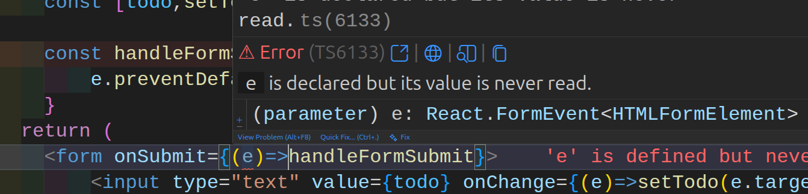

# 🚀 Complete React + TanStack Query Guide

> A comprehensive guide covering React fundamentals, hooks, routing, and advanced data fetching with TanStack Query

---

## 📑 Table of Contents

1. [React Fundamentals](#react-fundamentals)
2. [React Hooks Deep Dive](#react-hooks-deep-dive)
3. [Form Handling & Storage](#form-handling--storage)
4. [API Integration](#api-integration)
5. [React Router](#react-router)
6. [Context API](#context-api)
7. [Performance Optimization](#performance-optimization)
8. [TanStack Query (React Query)](#tanstack-query-react-query)
9. [Vitest Testing Guide for React](#vitest-testing-guide-for-react)
10. [React Redux Documentation](#react-redux-documentation)
11. [Redux Toolkit Complete Guide](#redux-toolkit-complete-guide)

---

## React Fundamentals

### What is React?

React is a JavaScript library for building user interfaces, developed by Meta (Facebook) in 2013. It uses a **component-based architecture** where each UI element is a reusable component.

**Key Problem Solved:** Before React, updating individual parts of a page (notifications, messages, friend requests) required full page reloads. React introduced **selective re-rendering** through the Virtual DOM.

### Virtual DOM vs Real DOM

| Type        | Description                                       |
| ----------- | ------------------------------------------------- |
| Real DOM    | Directly updates HTML, re-renders entire page     |
| Virtual DOM | Updates only changed parts for faster performance |

### Setup with Vite

```bash
npm create vite
npm install
npm run dev
```

### Basic Component Structure

```jsx
// App.jsx
const App = () => {
  const name = "Rayied";
  return <h1>Hello {name}!</h1>;
};

export default App;
```

### JSX Rules

- Must return a single parent element (use fragments `<>...</>`)
- Use `className` instead of `class`
- Close all tags (``, `<input />`)
- JavaScript expressions go inside `{}`

### Component Props

```jsx
// Parent Component
const App = () => {
  const jobs = [
    { company: "Google", role: "Frontend Engineer", location: "Dhaka" },
    { company: "Meta", role: "Backend Developer", location: "Bangladesh" },
  ];

  return (
    <div>
      {jobs.map((job, index) => (
        <Card key={index} {...job} />
      ))}
    </div>
  );
};

// Child Component
const Card = ({ company, role, location }) => (
  <div className="card">
    <h2>{company}</h2>
    <p>{role}</p>
    <p>{location}</p>
  </div>
);
```

**Best Practice:** Always provide unique `key` props when rendering lists. Use stable IDs instead of array indices when possible.

---

## React Hooks Deep Dive

### 1. useState - State Management

Manages local component state with automatic re-rendering.

```jsx
import { useState } from "react";

const Counter = () => {
  const [count, setCount] = useState(0);
  const [user, setUser] = useState({ name: "Sarthak", age: 25 });

  // Functional updates for batch operations
  const increment = () => setCount((prev) => prev + 1);

  // Object updates (immutable)
  const updateAge = () => setUser((prev) => ({ ...prev, age: 50 }));

  // Array updates (immutable)
  const [numbers, setNumbers] = useState([1, 2, 3]);
  const addNumber = () => setNumbers((prev) => [...prev, 4]);

  return (
    <div>
      <h1>Count: {count}</h1>
      <button onClick={increment}>Increment</button>
    </div>
  );
};
```

**Batch Updates Example:**

```jsx
const [count, setCount] = useState(10);

const batchUpdate = () => {
  setCount((prev) => prev + 1);
  setCount((prev) => prev + 1);
  setCount((prev) => prev + 1); // Increments by 3
};
```

### 2. useEffect - Side Effects

Handles side effects like API calls, subscriptions, timers, and DOM updates.

```jsx
import { useEffect, useState } from "react";

const DataFetcher = () => {
  const [data, setData] = useState(null);

  // Run once on mount (componentDidMount)
  useEffect(() => {
    fetchData();
  }, []);

  // Run when dependency changes
  useEffect(() => {
    console.log("Count changed:", count);
  }, [count]);

  // Cleanup function
  useEffect(() => {
    const timer = setInterval(() => console.log("tick"), 1000);

    return () => clearInterval(timer); // Runs on unmount
  }, []);

  return <div>{data}</div>;
};
```

**Dependency Rules:**

- `[]` → Runs **once** on mount
- `[dep1, dep2]` → Runs when dependencies change
- No array → Runs **after every render** (avoid!)

### 3. useRef - Mutable Values & DOM Access

Creates mutable values that **don't trigger re-renders**.

```jsx
import { useRef } from "react";

const InputFocus = () => {
  const inputRef = useRef(null);
  const countRef = useRef(0);

  const focusInput = () => {
    inputRef.current.focus();
  };

  const incrementSilent = () => {
    countRef.current += 1; // No re-render
    console.log(countRef.current);
  };

  return (
    <>
      <input ref={inputRef} />
      <button onClick={focusInput}>Focus Input</button>
    </>
  );
};
```

**Use Cases:**

- Accessing DOM elements
- Storing timers/intervals
- Keeping mutable values without re-rendering

### 4. useContext - Global State

Shares state across components without prop drilling.

```jsx
import { createContext, useContext, useState } from "react";

// Create Context
const ThemeContext = createContext();

// Provider Component
const ThemeProvider = ({ children }) => {
  const [theme, setTheme] = useState("light");

  return (
    <ThemeContext.Provider value={{ theme, setTheme }}>
      {children}
    </ThemeContext.Provider>
  );
};

// Consumer Component
const ThemedButton = () => {
  const { theme, setTheme } = useContext(ThemeContext);

  return (
    <button onClick={() => setTheme(theme === "light" ? "dark" : "light")}>
      Current: {theme}
    </button>
  );
};

// App Setup
const App = () => (
  <ThemeProvider>
    <ThemedButton />
  </ThemeProvider>
);
```

### 5. useReducer - Complex State Logic

Manages complex state with predictable updates.

```jsx
import { useReducer } from "react";

const reducer = (state, action) => {
  switch (action.type) {
    case "increment":
      return { ...state, count: state.count + 1 };
    case "decrement":
      return { ...state, count: state.count - 1 };
    case "reset":
      return { count: 0 };
    default:
      return state;
  }
};

const Counter = () => {
  const [state, dispatch] = useReducer(reducer, { count: 0 });

  return (
    <div>
      <h1>Count: {state.count}</h1>
      <button onClick={() => dispatch({ type: "increment" })}>+</button>
      <button onClick={() => dispatch({ type: "decrement" })}>-</button>
      <button onClick={() => dispatch({ type: "reset" })}>Reset</button>
    </div>
  );
};
```

### 6. useId - Unique Accessibility IDs

Generates unique IDs for form elements.

```jsx
import { useId } from "react";

const RegistrationForm = () => {
  const id = useId();

  return (
    <form>
      <div>
        <label htmlFor={`${id}-username`}>Username:</label>
        <input type="text" id={`${id}-username`} />
      </div>
      <div>
        <label htmlFor={`${id}-email`}>Email:</label>
        <input type="email" id={`${id}-email`} />
      </div>
      <div>
        <label htmlFor={`${id}-password`}>Password:</label>
        <input type="password" id={`${id}-password`} />
      </div>
    </form>
  );
};
```

**Best Practice:** Use one `useId()` call with suffixes instead of multiple calls.

### 7. use Hook (React 19+)

Flexible context and promise reading with conditional support.

```jsx
import { use } from "react";

const Profile = ({ isLoggedIn }) => {
  // ✅ Can be called conditionally
  if (isLoggedIn) {
    const user = use(UserContext);
    return <h1>Welcome, {user.name}!</h1>;
  }

  return <div>Please log in</div>;
};
```

**Key Differences from useContext:**

| Feature           | useContext     | use        |
| ----------------- | -------------- | ---------- |
| Conditional calls | ❌ Not allowed | ✅ Allowed |
| Inside loops      | ❌ Not allowed | ✅ Allowed |
| Promise support   | ❌ No          | ✅ Yes     |
| React version     | All versions   | React 19+  |

### 8. useMemo & useCallback - Performance

Optimizes expensive calculations and function references.

```jsx
import { useMemo, useCallback, useState } from "react";

const ExpensiveComponent = ({ items }) => {
  // Memoize expensive calculation
  const total = useMemo(() => {
    return items.reduce((sum, item) => sum + item.price, 0);
  }, [items]);

  // Memoize function reference
  const handleClick = useCallback(() => {
    console.log("Clicked!");
  }, []);

  return <div>Total: {total}</div>;
};
```

**Difference:**

- `useMemo` → Caches computed **values**
- `useCallback` → Caches **function references**

---

## Form Handling & Storage

### Controlled Components

```jsx
import { useState } from "react";

const LoginForm = () => {
  const [formData, setFormData] = useState({ email: "", password: "" });

  const handleSubmit = (e) => {
    e.preventDefault(); // Prevent page reload
    console.log(formData);
  };

  const handleChange = (e) => {
    const { name, value } = e.target;
    setFormData((prev) => ({ ...prev, [name]: value }));
  };

  return (
    <form onSubmit={handleSubmit}>
      <input
        name="email"
        value={formData.email}
        onChange={handleChange}
        placeholder="Email"
      />
      <input
        name="password"
        type="password"
        value={formData.password}
        onChange={handleChange}
        placeholder="Password"
      />
      <button>Submit</button>
    </form>
  );
};
```

### localStorage vs sessionStorage

| Feature  | localStorage               | sessionStorage         |
| -------- | -------------------------- | ---------------------- |
| Lifetime | Persistent (until cleared) | Session only           |
| Scope    | All tabs (same origin)     | Single tab             |
| Size     | ~5-10 MB                   | ~5 MB                  |
| Use Case | User preferences, tokens   | Temporary session data |

```jsx
// Store data
localStorage.setItem("user", JSON.stringify({ name: "Rayied", age: 25 }));

// Retrieve data
const user = JSON.parse(localStorage.getItem("user"));

// Remove item
localStorage.removeItem("user");

// Clear all
localStorage.clear();
```

---

## API Integration

### Using fetch()

```jsx
const fetchData = async () => {
  try {
    const response = await fetch("https://api.example.com/data");
    const data = await response.json();
    console.log(data);
  } catch (error) {
    console.error("Error:", error);
  }
};
```

### Using axios

```bash
npm install axios
```

```jsx
import axios from "axios";

const fetchData = async () => {
  try {
    const response = await axios.get("https://api.example.com/data");
    console.log(response.data);
  } catch (error) {
    console.error("Error:", error);
  }
};

// POST request
const createUser = async () => {
  try {
    const response = await axios.post("https://api.example.com/users", {
      name: "Rayied",
      email: "rayied@example.com",
    });
    console.log(response.data);
  } catch (error) {
    console.error("Error:", error);
  }
};
```

**Comparison:**

| Feature        | fetch()   | axios               |
| -------------- | --------- | ------------------- |
| Built-in       | ✅ Yes    | ❌ Requires install |
| JSON parsing   | ❌ Manual | ✅ Automatic        |
| Interceptors   | ❌ No     | ✅ Yes              |
| Error handling | Basic     | Advanced            |

---

## React Router

### Installation

```bash
npm install react-router-dom@6
```

### Basic Setup

```jsx
import { BrowserRouter, Routes, Route, Link } from "react-router-dom";
import Home from "./pages/Home";
import About from "./pages/About";
import NotFound from "./pages/NotFound";

const App = () => {
  return (
    <BrowserRouter>
      <nav>
        <Link to="/">Home</Link>
        <Link to="/about">About</Link>
      </nav>

      <Routes>
        <Route path="/" element={<Home />} />
        <Route path="/about" element={<About />} />
        <Route path="*" element={<NotFound />} />
      </Routes>
    </BrowserRouter>
  );
};
```

### Dynamic Routes

```jsx
import { useParams, useNavigate } from "react-router-dom";

const UserProfile = () => {
  const { id } = useParams();
  const navigate = useNavigate();

  return (
    <div>
      <h1>User ID: {id}</h1>
      <button onClick={() => navigate("/")}>Go Home</button>
    </div>
  );
};

// Route definition
<Route path="/users/:id" element={<UserProfile />} />;
```

### Router Types

| Router        | Use Case                               |
| ------------- | -------------------------------------- |
| BrowserRouter | Standard web apps with server support  |
| HashRouter    | Static hosting without server fallback |
| MemoryRouter  | Testing or non-DOM environments        |

---

## Context API

### Complete Example

```jsx
// 1. Create Context
import { createContext, useState } from "react";

export const ThemeContext = createContext();

// 2. Provider Component
const ThemeProvider = ({ children }) => {
  const [theme, setTheme] = useState("light");

  return (
    <ThemeContext.Provider value={{ theme, setTheme }}>
      {children}
    </ThemeContext.Provider>
  );
};

// 3. Wrap App
import { createRoot } from "react-dom/client";

createRoot(document.getElementById("root")).render(
  <ThemeProvider>
    <App />
  </ThemeProvider>
);

// 4. Consume Context
import { useContext } from "react";
import { ThemeContext } from "./ThemeContext";

const ThemedComponent = () => {
  const { theme, setTheme } = useContext(ThemeContext);

  return (
    <div className={theme}>
      <button onClick={() => setTheme(theme === "light" ? "dark" : "light")}>
        Toggle Theme
      </button>
    </div>
  );
};
```

---

## Performance Optimization

### Lazy Loading with Suspense

```jsx
import { lazy, Suspense } from "react";

const Dashboard = lazy(() => import("./Dashboard"));
const Settings = lazy(() => import("./Settings"));

const App = () => {
  return (
    <Suspense fallback={<div>Loading...</div>}>
      <Routes>
        <Route path="/dashboard" element={<Dashboard />} />
        <Route path="/settings" element={<Settings />} />
      </Routes>
    </Suspense>
  );
};
```

### Infinite Scrolling

```jsx
import { useEffect, useRef, useState } from "react";

const InfiniteList = ({ fetchPage }) => {
  const [items, setItems] = useState([]);
  const [page, setPage] = useState(1);
  const [hasMore, setHasMore] = useState(true);
  const loaderRef = useRef(null);

  useEffect(() => {
    fetchPage(page).then(({ data, more }) => {
      setItems((prev) => [...prev, ...data]);
      setHasMore(more);
    });
  }, [page]);

  useEffect(() => {
    const observer = new IntersectionObserver(
      (entries) => {
        if (entries[0].isIntersecting && hasMore) {
          setPage((prev) => prev + 1);
        }
      },
      { threshold: 1 }
    );

    if (loaderRef.current) observer.observe(loaderRef.current);
    return () => observer.disconnect();
  }, [hasMore]);

  return (
    <div>
      {items.map((item, i) => (
        <div key={i}>{item.title}</div>
      ))}
      <div ref={loaderRef} />
    </div>
  );
};
```

---

## TanStack Query (React Query)

### What is TanStack Query?

A powerful library for managing **server-side state** in React applications with features like:

- ✅ Automatic caching
- ✅ Background refetching
- ✅ Built-in loading/error states
- ✅ Pagination & infinite scrolling
- ✅ Optimistic updates

### Installation

```bash
npm install @tanstack/react-query
npm install @tanstack/react-query-devtools
```

### Setup

```jsx
import { QueryClient, QueryClientProvider } from "@tanstack/react-query";
import { ReactQueryDevtools } from "@tanstack/react-query-devtools";

const queryClient = new QueryClient();

const App = () => (
  <QueryClientProvider client={queryClient}>
    <YourApp />
    <ReactQueryDevtools initialIsOpen={false} />
  </QueryClientProvider>
);
```

### useQuery - Fetching Data

```jsx
import { useQuery } from "@tanstack/react-query";

const fetchPosts = async () => {
  const response = await fetch("https://api.example.com/posts");
  return response.json();
};

const PostsList = () => {
  const { data, isLoading, isError, error } = useQuery({
    queryKey: ["posts"],
    queryFn: fetchPosts,
  });

  if (isLoading) return <p>Loading...</p>;
  if (isError) return <p>Error: {error.message}</p>;

  return (
    <ul>
      {data.map((post) => (
        <li key={post.id}>{post.title}</li>
      ))}
    </ul>
  );
};
```

### Configuration Options

```jsx
const { data } = useQuery({
  queryKey: ["posts"],
  queryFn: fetchPosts,
  staleTime: 10000, // Data fresh for 10s
  gcTime: 300000, // Cache for 5 min
  refetchInterval: 5000, // Poll every 5s
  refetchIntervalInBackground: true,
});
```

### Dynamic Queries

```jsx
import { useParams } from "react-router-dom";

const PostDetail = () => {
  const { id } = useParams();

  const { data } = useQuery({
    queryKey: ["post", id],
    queryFn: () => fetchPost(id),
  });

  return <div>{data?.title}</div>;
};
```

### Pagination

```jsx
import { keepPreviousData, useQuery } from "@tanstack/react-query";
import { useState } from "react";

const PaginatedPosts = () => {
  const [page, setPage] = useState(0);

  const { data } = useQuery({
    queryKey: ["posts", page],
    queryFn: () => fetchPosts(page),
    placeholderData: keepPreviousData,
  });

  return (
    <div>
      <ul>
        {data?.map((post) => (
          <li key={post.id}>{post.title}</li>
        ))}
      </ul>
      <button onClick={() => setPage((p) => Math.max(0, p - 1))}>
        Previous
      </button>
      <button onClick={() => setPage((p) => p + 1)}>Next</button>
    </div>
  );
};
```

### useMutation - Modifying Data

```jsx
import { useMutation, useQueryClient } from "@tanstack/react-query";

const PostManager = () => {
  const queryClient = useQueryClient();

  // Delete mutation
  const deleteMutation = useMutation({
    mutationFn: (id) => deletePost(id),
    onSuccess: (data, id) => {
      // Update cache
      queryClient.setQueryData(["posts"], (oldData) =>
        oldData.filter((post) => post.id !== id)
      );
    },
  });

  // Update mutation
  const updateMutation = useMutation({
    mutationFn: ({ id, data }) => updatePost(id, data),
    onSuccess: (apiData, { id }) => {
      queryClient.setQueryData(["posts"], (oldData) =>
        oldData.map((post) => (post.id === id ? { ...post, ...apiData } : post))
      );
    },
  });

  return (
    <div>
      <button onClick={() => deleteMutation.mutate(postId)}>Delete</button>
      <button onClick={() => updateMutation.mutate({ id, data })}>
        Update
      </button>
    </div>
  );
};
```

### Infinite Scrolling with useInfiniteQuery

```jsx
import { useInfiniteQuery } from "@tanstack/react-query";
import { useInView } from "react-intersection-observer";
import { useEffect } from "react";

const InfiniteUsers = () => {
  const { data, hasNextPage, fetchNextPage, isFetchingNextPage } =
    useInfiniteQuery({
      queryKey: ["users"],
      queryFn: ({ pageParam = 1 }) => fetchUsers(pageParam),
      getNextPageParam: (lastPage, allPages) =>
        lastPage.length === 10 ? allPages.length + 1 : undefined,
    });

  const { ref, inView } = useInView({ threshold: 1 });

  useEffect(() => {
    if (inView && hasNextPage) {
      fetchNextPage();
    }
  }, [inView, hasNextPage]);

  return (
    <div>
      {data?.pages.map((page, i) => (
        <div key={i}>
          {page.map((user) => (
            <div key={user.id}>{user.name}</div>
          ))}
        </div>
      ))}

      <div ref={ref}>
        {isFetchingNextPage
          ? "Loading..."
          : hasNextPage
          ? "Load more"
          : "No more"}
      </div>
    </div>
  );
};
```

### TanStack Query Summary

| Feature            | Hook                | Purpose                  |
| ------------------ | ------------------- | ------------------------ |
| Fetch data         | `useQuery`          | GET requests             |
| Modify data        | `useMutation`       | POST, PUT, DELETE        |
| Infinite scroll    | `useInfiniteQuery`  | Progressive data loading |
| Invalidate cache   | `invalidateQueries` | Force refetch            |
| Optimistic updates | `setQueryData`      | Instant UI updates       |

---

## Quick Reference Tables

### Hook Comparison

| Hook        | Purpose           | Re-renders? |
| ----------- | ----------------- | ----------- |
| useState    | Local state       | ✅ Yes      |
| useEffect   | Side effects      | ❌ No       |
| useRef      | Mutable values    | ❌ No       |
| useContext  | Global state      | ✅ Yes      |
| useReducer  | Complex state     | ✅ Yes      |
| useMemo     | Memoize values    | ❌ No       |
| useCallback | Memoize functions | ❌ No       |

### When to Use What

| Scenario                  | Solution              |
| ------------------------- | --------------------- |
| Simple counter            | useState              |
| API data fetching         | useQuery (TanStack)   |
| Form inputs               | useState + controlled |
| Global theme              | useContext            |
| Complex form state        | useReducer            |
| Expensive calculations    | useMemo               |
| Child component callbacks | useCallback           |
| Pagination                | useQuery + page state |
| Infinite scroll           | useInfiniteQuery      |

---

## Best Practices

### General React

1. ✅ Use functional components with hooks
2. ✅ Keep components small and focused
3. ✅ Use meaningful variable names
4. ✅ Always handle loading and error states
5. ✅ Memoize expensive operations
6. ✅ Use proper key props in lists
7. ✅ Clean up side effects in useEffect
8. ✅ Avoid inline function definitions in JSX

### TanStack Query

1. ✅ Use unique, descriptive queryKeys
2. ✅ Configure staleTime and gcTime appropriately
3. ✅ Implement error boundaries
4. ✅ Use placeholderData for smooth pagination
5. ✅ Invalidate queries after mutations
6. ✅ Keep queryFn functions pure
7. ✅ Enable React Query DevTools in development
8. ✅ Handle loading states with Suspense boundaries

---

## Production Build

```bash
npm run build
```

This creates an optimized production build in the `dist` folder. Deploy this folder to your hosting service.

---

## Additional Resources

- [React Documentation](https://react.dev)
- [TanStack Query Docs](https://tanstack.com/query/latest)
- [React Router Documentation](https://reactrouter.com)
- [MDN Web Docs](https://developer.mozilla.org)

---

**© 2025 — Complete React + TanStack Query Guide**

# Vitest Testing Guide for React

## Installation

Install the required dependencies:

```bash
npm install --save-dev vitest @testing-library/react @testing-library/user-event @testing-library/jest-dom jsdom
```

## Configuration

Create `vitest.config.js` in your project root:

```javascript
import react from "@vitejs/plugin-react";
import { defineConfig } from "vite";

export default defineConfig({
  plugins: [react()],
  test: {
    environment: "jsdom",
  },
});
```

Update your `package.json` to add the test script:

```json
"scripts": {
  "dev": "vite",
  "build": "vite build",
  "lint": "eslint .",
  "preview": "vite preview",
  "test": "vitest"
}
```

## Running Tests

```bash
npm test
```

---

## Testing Patterns

### 1. Basic Component Testing

**Component: `Greetings.jsx`**

```jsx
function Greeting({ name = "World" }) {
  return <h1>Hello, {name}!</h1>;
}

export default Greeting;
```

**Test: `greetings.test.jsx`**

```jsx
import "@testing-library/jest-dom/vitest";
import { render, screen } from "@testing-library/react";
import { describe, expect, it } from "vitest";
import Greeting from "./Greetings";

describe("Greeting", () => {
  it("renders a default greeting", () => {
    render(<Greeting />);
    expect(screen.getByText("Hello, World!")).toBeInTheDocument();
  });

  it("renders a custom greeting", () => {
    render(<Greeting name="Rayied" />);
    expect(screen.getByText("Hello, Rayied!")).toBeInTheDocument();
  });
});
```

#### Key Query Methods

- **`getByText`**: Throws an error if nothing is found. Use when you're certain the element exists.
- **`queryByText`**: Returns `null` if nothing is found (no error). Use when testing that an element doesn't exist or when unsure if it exists.

---

### 2. Testing User Interactions

**Component: `Counter.jsx`**

```jsx
import { useCounter } from "../../hooks/useCounter";

function Counter() {
  const { count, increment } = useCounter();

  return (
    <div>
      <p data-testid="counter-value">{count}</p>
      <button onClick={increment}>Increment</button>
    </div>
  );
}

export default Counter;
```

**Test: `counter.test.jsx`**

```jsx
import "@testing-library/jest-dom/vitest";
import { render, screen } from "@testing-library/react";
import userEvent from "@testing-library/user-event";
import { describe, expect, it } from "vitest";
import Counter from "./Counter";

describe("Counter", () => {
  it("increments counter on button click", async () => {
    render(<Counter />);

    const button = screen.getByRole("button", { name: /increment/i });
    const counterValue = screen.getByTestId("counter-value");

    expect(counterValue.textContent).toEqual("0");

    // Test button clicks
    await userEvent.click(button);
    expect(counterValue.textContent).toEqual("1");

    await userEvent.click(button);
    expect(counterValue.textContent).toEqual("2");
  });
});
```

#### Important Notes

- Use `userEvent` for simulating user interactions (more realistic than `fireEvent`)
- Always `await` user events
- Use `data-testid` attributes for elements that are hard to query by role or text

---

### 3. Testing Async Operations & API Calls

**Component: `UserProfile.jsx`**

```jsx
import { useEffect, useState } from "react";

function UserProfile({ userId }) {
  const [user, setUser] = useState(null);

  useEffect(() => {
    fetch(`https://jsonplaceholder.typicode.com/users/${userId}`)
      .then((res) => res.json())
      .then((data) => setUser(data));
  }, [userId]);

  if (!user) return <p>Loading...</p>;

  return (
    <div>
      <h2>{user.name}</h2>
      <p>{user.email}</p>
    </div>
  );
}

export default UserProfile;
```

**Test: `userprofile.test.jsx`**

```jsx
import "@testing-library/jest-dom/vitest";
import { render, screen, waitFor } from "@testing-library/react";
import { afterEach, beforeEach, describe, expect, it, vi } from "vitest";
import UserProfile from "./UserProfile";

describe("UserProfile", () => {
  beforeEach(() => {
    global.fetch = vi.fn();
  });

  afterEach(() => {
    vi.resetAllMocks();
  });

  it("fetches and displays the user data", async () => {
    global.fetch.mockResolvedValueOnce({
      json: async () => ({
        id: 4,
        name: "John",
        email: "john@gmail.com",
      }),
    });

    render(<UserProfile userId={4} />);

    expect(screen.getByText(/loading/i)).toBeInTheDocument();

    await waitFor(() => {
      expect(
        screen.getByRole("heading", { name: /john/i })
      ).toBeInTheDocument();
      expect(screen.getByText(/john@gmail.com/i)).toBeInTheDocument();
    });
  });
});
```

#### Key Concepts for Async Testing

- **`vi.fn()`**: Creates a mock function
- **`mockResolvedValueOnce()`**: Mocks a successful Promise resolution
- **`beforeEach`**: Runs before each test (setup)
- **`afterEach`**: Runs after each test (cleanup)
- **`waitFor`**: Waits for async operations to complete
- **`vi.resetAllMocks()`**: Cleans up all mocks

---

### 4. Testing Custom Hooks

**Hook: `useCounter.jsx`**

```jsx
import { useState } from "react";

export const useCounter = (initValue = 0) => {
  const [count, setCount] = useState(initValue);

  function increment() {
    setCount((c) => c + 1);
  }

  function decrement() {
    setCount((c) => c - 1);
  }

  function reset() {
    setCount(0);
  }

  return { count, increment, decrement, reset };
};
```

**Test: `usecounter.test.jsx`**

```jsx
import "@testing-library/jest-dom/vitest";
import { act, renderHook } from "@testing-library/react";
import { describe, expect, it } from "vitest";
import { useCounter } from "./useCounter";

describe("useCounter", () => {
  it("initializes with value 5", () => {
    const { result } = renderHook(() => useCounter(5));
    expect(result.current.count).toBe(5);
  });

  it("increments the count", () => {
    const { result } = renderHook(() => useCounter(0));
    expect(result.current.count).toBe(0);

    act(() => {
      result.current.increment();
    });
    expect(result.current.count).toBe(1);

    act(() => {
      result.current.increment();
    });
    expect(result.current.count).toBe(2);
  });

  it("decrements the count", () => {
    const { result } = renderHook(() => useCounter(5));
    expect(result.current.count).toBe(5);

    act(() => {
      result.current.decrement();
    });
    expect(result.current.count).toBe(4);
  });

  it("resets the count to 0", () => {
    const { result } = renderHook(() => useCounter(4));
    expect(result.current.count).toBe(4);

    act(() => {
      result.current.reset();
    });
    expect(result.current.count).toBe(0);
  });
});
```

#### Hook Testing Essentials

- **`renderHook`**: Renders a hook in isolation
- **`act`**: Wraps state updates to ensure they're processed
- **`result.current`**: Access the hook's return value

---

## Best Practices

1. **Test user behavior, not implementation details**: Focus on what users see and do
2. **Use semantic queries**: Prefer `getByRole`, `getByLabelText` over `getByTestId`
3. **Keep tests isolated**: Each test should be independent
4. **Clean up after tests**: Use `afterEach` to reset mocks and state
5. **Test loading states**: Verify both loading and success states
6. **Use meaningful test descriptions**: Describe what the test does clearly
7. **Await async operations**: Always use `await` with `userEvent` and `waitFor`

---

## Common Query Methods

| Method        | Returns          | Throws Error | Use Case                       |
| ------------- | ---------------- | ------------ | ------------------------------ |
| `getBy*`      | Element          | Yes          | Element should exist           |
| `queryBy*`    | Element or null  | No           | Element might not exist        |
| `findBy*`     | Promise<Element> | Yes          | Async elements                 |
| `getAllBy*`   | Array            | Yes          | Multiple elements              |
| `queryAllBy*` | Array            | No           | Multiple elements (maybe none) |
| `findAllBy*`  | Promise<Array>   | Yes          | Async multiple elements        |

---

## Additional Tips

- Use `/i` flag in regex for case-insensitive matching: `/loading/i`
- Mock external dependencies to keep tests fast and reliable
- Use `screen.debug()` to see the current DOM state during debugging
- Run tests in watch mode during development: `npm test -- --watch`

# React Redux Documentation

## Why Redux?

In small apps you can manage data using React's state. But as the app grows, it becomes tricky to pass data between many components.

Redux solves this problem by creating a centralized store that holds all the data. This store can be accessed and updated by any part of the app.

**React Redux = Context API + useReducer**

## What is Redux?

Redux is a tool that helps manage data (also known as "state") in large React apps. It allows us to keep all our app's data in a single place, known as the Redux Store, making it easy to share and update data across different parts of the app.

## How Redux Works

- **Store**: This is where Redux keeps all your data.
- **Action**: This is an object which tells Redux what to do (like adding a task).
- **Reducers**: How to do. It actually changes the data in the store based on actions.

### Store

The Redux store is like a big box where all your application's data is kept safe. Everything you do with Redux - whether adding, removing or updating data - goes through this store.

### Actions

This is an Object which tells Redux what to do (like adding a task).

```javascript
{
  type: "counter/add",
  payload: {
    incrementBy: 10
  }
}
```

**payload**: extra information

### Reducers

How to do. It actually changes the data in the store based on the actions.

```javascript
export const CounterReducer = (state = initialState, action) => {
  switch (action.type) {
    case "counter/add":
      return { ...state, value: state.value + action.payload.incrementBy };
    default:
      return state;
  }
};
```

## Redux Advantages

- **Centralized state management**: Redux stores your app's state in one place, making it easier to manage and access data across components.
- **Global access**: Any component can access and update the state without passing props down.
- **Predictable Updates**: State changes are controlled and predictable using reducers.
- **DevTools**: Powerful tools for debugging, inspecting state and replaying actions.
- **Async Support**: Middleware like Thunk or Saga handles async tasks, keeping the code clean.

## Redux: Reducer Function

A reducer is a function that decides how the state should change based on the action. The reducer takes the current state and an action and returns a new state.

### Key Things to Remember

1. Reducers must always return a new state
2. They should never modify the old state directly

### Syntax: Reducer

```javascript
function reducer(state = initialState, action) {
  // reducer logic
}
```

The reducer takes two arguments:

- **State**: This is the current state.
- **Action**: This tells the reducer what to do. It has a type and sometimes a payload (which is the data).

```javascript
function reducer(state = initialState, action) {
  switch (action.type) {
    case "ACTION_TYPE":
      return { ...state, data: action.payload };
    default:
      return state;
  }
}
```

We use a switch statement to check the action's type. Based on the action type, the reducer updates the state.

### Best Practices for Reducers

```javascript
const ACTION_TYPE = "task/add";

function reducer(state = initialState, action) {
  switch (action.type) {
    case ACTION_TYPE:
      return { ...state, data: action.payload };
  }
}
```

- **Action Types**: Use a combination of the state domain (like task) and the event (like add), separated by a slash. For example, `task/add`.
- **Immutable state**: Never directly change the state. Always return a new state object using `...state` to copy the old state.

### Example: store.jsx

```javascript
/* eslint-disable no-case-declarations */
const ADD_TASK = "task/add";
const DELETE_TASK = "task/delete";

const initialState = {
  task: [],
};

const taskReducer = (state = initialState, action) => {
  switch (action.type) {
    case ADD_TASK:
      return { ...state, task: [...state.task, action.payload] };

    case DELETE_TASK:
      const updatedTask = state.task.filter((currTask, idx) => {
        return idx !== action.payload;
      });
      return { ...state, task: updatedTask };

    default:
      return state;
  }
};
```

## Redux Store

The store is where Redux keeps all your app's data. It's like a database for your app, but it's only for managing data in memory (not saving it permanently).

### Redux Store - Syntax

```javascript
import { createStore } from "redux";
const store = createStore(reducer);
```

The `createStore` method creates the Redux store using a reducer function that handles how the state changes in response to actions.

### dispatch() an Action

`dispatch()` is used to send actions to the Redux store. An action describes what change you want to make to the state (such as adding a task).

```javascript
store.dispatch({ type: "ACTION_TYPE", payload: data });
```

### getState()

`getState()` retrieves the current state of the Redux store. This is useful for accessing the state after it has been updated or to monitor changes.

Example: check if deleted or not, or added or not

## Redux Installation

```bash
npm i redux
```

**Note**: `createStore` is now deprecated

### Complete Example: store.jsx

```javascript
import { createStore } from "redux";
/* eslint-disable no-case-declarations */

// define action types
const ADD_TASK = "task/add";
const DELETE_TASK = "task/delete";

const initialState = {
  task: [],
  isLoading: false,
};

// step-1: create a simple reducer function
const taskReducer = (state = initialState, action) => {
  switch (action.type) {
    case ADD_TASK:
      return { ...state, task: [...state.task, action.payload] };

    case DELETE_TASK:
      const updatedTask = state.task.filter((currTask, idx) => {
        return idx !== action.payload;
      });
      return { ...state, task: updatedTask };

    default:
      return state;
  }
};

// step-2: create Redux store using the reducer
const store = createStore(taskReducer);
console.log(store);

// step-3: log the initial state
// The getState method is a synchronous function that returns the current state of Redux application.
// It includes the entire state of the application, including reducers and their respective states.
console.log("initial state:", store.getState());

// step-4: dispatch an action to add a task
store.dispatch({ type: ADD_TASK, payload: "Buy LocalStudio" });
console.log("updated state: ", store.getState());

store.dispatch({ type: ADD_TASK, payload: "Buy pdf" });
console.log("updated state: ", store.getState());

store.dispatch({ type: DELETE_TASK, payload: 1 });
console.log("deleted state: ", store.getState());
```

### To Use Store

Import in `main.jsx`:

```javascript
import "./store.jsx";
```

## Redux Action

An action is an object that tells Redux what we want to do. It must have a `type` property that describes the action.

```javascript
{ type: "ACTION_TYPE", payload: data }
```

## Action Creator

An action creator is a function that creates an action object. This makes it easier to create actions with different data.

```javascript
function actionCreator(data) {
  return { type: "ACTION_TYPE", payload: data };
}
```

### Easy to Write Code

```javascript
import { createStore } from "redux";
/* eslint-disable no-case-declarations */

// define action types
const ADD_TASK = "task/add";
const DELETE_TASK = "task/delete";

const initialState = {
  task: [],
  isLoading: false,
};

// step-1: create a simple reducer function
const taskReducer = (state = initialState, action) => {
  switch (action.type) {
    case ADD_TASK:
      return { ...state, task: [...state.task, action.payload] };

    case DELETE_TASK:
      const updatedTask = state.task.filter((currTask, idx) => {
        return idx !== action.payload;
      });
      return { ...state, task: updatedTask };

    default:
      return state;
  }
};

// step-2: create Redux store using the reducer
const store = createStore(taskReducer);
console.log(store);

// step-3: log the initial state
console.log("initial state:", store.getState());

// step-4(old): dispatch an action to add a task
// store.dispatch({ type: ADD_TASK, payload: "Buy LocalStudio" });
// console.log("updated state: ", store.getState());
// store.dispatch({ type: ADD_TASK, payload: "Buy pdf" });
// console.log("updated state: ", store.getState());
// store.dispatch({ type: DELETE_TASK, payload: 1 });
// console.log("deleted state: ", store.getState());

// step-5: create action creators
const addTask = (data) => {
  return { type: ADD_TASK, payload: data };
};

// step-4(new): dispatch an action to add a task
store.dispatch(addTask("Buy LocalStudio"));
console.log("updated state: ", store.getState());

store.dispatch(addTask("Buy pdf"));
console.log("updated state: ", store.getState());

const deleteTask = (id) => {
  return { type: DELETE_TASK, payload: id };
};

store.dispatch(deleteTask(1));
console.log("deleted state: ", store.getState());

export default store;
```

## Connect React with Redux

To use Redux in a React app, we need to connect Redux's store and actions to React components. This allows components to access the global state and dispatch actions.

### Steps to Connect

#### Step 1: Install react-redux

```bash
npm install react-redux
```

#### Step 2: Wrap the App with Provider

Use the `Provider` component to pass the Redux store to the entire app.

**main.jsx:**

```javascript
import { StrictMode } from "react";
import { createRoot } from "react-dom/client";
import { Provider } from "react-redux";
import App from "./App.jsx";
import "./index.css";
import "./store.jsx";
import store from "./store.jsx";

createRoot(document.getElementById("root")).render(
  <StrictMode>
    <Provider store={store}>
      <App />
    </Provider>
  </StrictMode>
);
```

**store.jsx:**

```javascript
export const store = createStore(taskReducer);
```

## Access Redux State in React using useSelector

Use the `useSelector` hook to read data from the Redux store.

```javascript
const count = useSelector((state) => state.property);
```

**Selector function**: We define a selector function that takes the entire Redux store state as an argument and returns the specific piece of data we need.

### Example: Todo.jsx

```javascript
import { MdDeleteForever } from "react-icons/md";
import { useSelector } from "react-redux";

const Todo = () => {
  const tasks = useSelector((state) => state.task);

  const handleTaskDelete = (idx) => {};

  return (
    <>
      <div className="container">
        <div className="todo-app">
          <h1>
            <i className="fa-regular fa-pen-to-square"></i>To-do List:
          </h1>
          <div className="row">
            <form>
              <input type="text" id="input-box" placeholder="Add a new Task" />
              <button>Add Task</button>
            </form>
          </div>
          <ul id="list-container">
            {tasks.map((curTask, idx) => {
              return (
                <li key={idx}>
                  <p>
                    {idx + 1}: {curTask}
                  </p>
                  <div>
                    <MdDeleteForever
                      className="icon-style"
                      onClick={() => handleTaskDelete(idx)}
                    />
                  </div>
                </li>
              );
            })}
          </ul>
        </div>
      </div>
    </>
  );
};

export default Todo;
```

**store.jsx:**

```javascript
store.dispatch(addTask("Buy LocalStudio"));
store.dispatch(addTask("Buy Tesla"));
store.dispatch(addTask("Buy Youtube"));
```

## Dispatch Actions in React using useDispatch

Use the `useDispatch` hook to dispatch actions from a React component.

### Example: Todo.jsx

```javascript
import { useState } from "react";
import { MdDeleteForever } from "react-icons/md";
import { useDispatch, useSelector } from "react-redux";
import { addTask, deleteTask } from "../store";

const Todo = () => {
  const [task, setTask] = useState("");
  const tasks = useSelector((state) => state.task);

  const dispatch = useDispatch();

  const handleTaskDelete = (id) => {
    return dispatch(deleteTask(id));
  };

  const handleFormSubmit = (e) => {
    e.preventDefault();
    dispatch(addTask(task));
    return setTask("");
  };

  return (
    <>
      <div className="container">
        <div className="todo-app">
          <h1>
            <i className="fa-regular fa-pen-to-square"></i>To-do List:
          </h1>
          <div className="row">
            <form onSubmit={handleFormSubmit}>
              <input
                type="text"
                id="input-box"
                placeholder="Add a new Task"
                value={task}
                onChange={(e) => setTask(e.target.value)}
              />
              <button>Add Task</button>
            </form>
          </div>
          <ul id="list-container">
            {tasks.map((curTask, idx) => {
              return (
                <li key={idx}>
                  <p>
                    {idx + 1}: {curTask}
                  </p>
                  <div>
                    <MdDeleteForever
                      className="icon-style"
                      onClick={() => handleTaskDelete(idx)}
                    />
                  </div>
                </li>
              );
            })}
          </ul>
        </div>
      </div>
    </>
  );
};

export default Todo;
```

**store.jsx:**

```javascript
export const addTask = (data) => {
  return { type: ADD_TASK, payload: data };
};

export const deleteTask = (id) => {
  return { type: DELETE_TASK, payload: id };
};
```

## Installation Redux DevTools

**Link**: [Redux DevTools Chrome Extension](https://chromewebstore.google.com/detail/redux-devtools/lmhkpmbekcpmknklioeibfkpmmfibljd?hl=en)

```bash
npm i @redux-devtools/extension
```

**store.jsx:**

```javascript
import { composeWithDevTools } from "@redux-devtools/extension";

export const store = createStore(taskReducer, composeWithDevTools());
```

## Redux Thunk in React

Redux Thunk is middleware that allows you to write action creators that return a function instead of an action (action means pure object). This function can perform asynchronous logic (like API requests) and dispatch actions after the operation is complete (e.g., fetching tasks and then dispatching them to the store).

When you return a function from an action creator, Redux Thunk provides the dispatch function as an argument. This allows you to manually dispatch other actions (e.g., when an API call succeeds or fails).

### Install Redux-Thunk

```bash
npm i redux-thunk
```

### Example: store.jsx

```javascript
import { composeWithDevTools } from "@redux-devtools/extension";
import { applyMiddleware, createStore } from "redux";
import { thunk } from "redux-thunk";

const FETCH_TASK = "task/fetch";

const taskReducer = (state = initialState, action) => {
  switch (action.type) {
    case ADD_TASK:
      return { ...state, task: [...state.task, action.payload] };

    case DELETE_TASK:
      const updatedTask = state.task.filter((currTask, idx) => {
        return idx !== action.payload;
      });
      return { ...state, task: updatedTask };

    case FETCH_TASK:
      return { ...state, task: [...state.task, ...action.payload] };

    default:
      return state;
  }
};

export const store = createStore(
  taskReducer,
  composeWithDevTools(applyMiddleware(thunk))
);

// middleware
export const fetchTask = () => {
  return async (dispatch) => {
    try {
      const res = await fetch(
        "https://jsonplaceholder.typicode.com/todos?_limit=3"
      );
      const task = await res.json();
      console.log(task);
      dispatch({
        type: FETCH_TASK,
        payload: task.map((curTask) => curTask.title),
      });
    } catch (error) {
      console.log(error);
    }
  };
};
```

# Redux Toolkit Complete Guide

## Which one to select?

1. React-Redux
2. Redux Toolkit ✅

---

## What is Redux Toolkit?

**Redux Toolkit (RTK)** is an official toolset from the Redux Team that makes working with Redux easier and less time-consuming.

Instead of doing everything manually—like creating actions, reducers and managing state immutability—RTK gives you built-in functions that handle most of that work for you.

**In simpler terms:** It's a shortcut that helps you manage your app's state with less code and fewer mistakes. The goal is to make Redux more beginner-friendly and reduce the amount of code you need to write.

---

## Why Redux Toolkit?

### Less Boilerplate

In traditional Redux, you write a lot of repetitive code just to get basic things done. RTK cuts down on all that extra code and gives you a cleaner, simpler way to manage state.

### Simpler Setup

It automatically sets up your store, adds middleware for things like async actions, and even connects you to Redux DevTools for debugging without extra configuration.

### Built-in Async Handling

If you've ever used Redux Thunk for async tasks like fetching data from an API, RTK has a built-in feature called `createAsyncThunk` that makes it even easier to handle async actions.

---

## Advantages

### Less Boilerplate Code

Normally, with Redux, you need to write action types, action creators, and reducers separately. With RTK's `createSlice`, you can handle all of this in one place, in fewer lines of code.

### Easier to Work with State

RTK uses a tool called **Immer** (library) under the hood, which allows you to write state changes like you're mutating the state directly, but it still follows Redux's rule of immutability (not changing the original state).

### Better Async Logic

Handling async tasks, like fetching data, is much simpler with RTK's `createAsyncThunk`. It automatically handles loading, success, and error states for you, so you don't have to write all that manually.

### Great Defaults

RTK sets up Redux DevTools, middleware, and other configuration for you, so you can focus on building your app instead of setup.

> **Note:** RTK is a helper function of Redux React.

---

## Comparison: Redux vs Redux Toolkit

### Traditional Redux

```javascript
// Action types
const INCREMENT = "INCREMENT";

// Action creators
const increment = () => ({ type: INCREMENT });

// Initial state
const initialState = { value: 0 };

function counterReducer(state = initialState, action) {
  switch (action.type) {
    case INCREMENT:
      return {
        ...state, // copying the previous state
        value: state.value + 1, // updating value
      };
    default:
      return state;
  }
}
```

### Redux Toolkit

```javascript
import { createSlice } from "@reduxjs/toolkit";

const counterSlice = createSlice({
  name: "counter",
  initialState: { value: 0 },
  reducers: {
    increment(state) {
      state.value += 1; // Immer handles immutability behind the scenes
    },
  },
});

export const { increment } = counterSlice.actions;
export default counterSlice.reducer;
```

---

## Installation

```bash
npm i @reduxjs/toolkit
```

---

## RTK Store: configureStore & useSelector

### Old Style (Traditional Redux)

```javascript
// Step-2: create Redux store using the reducer
export const store = createStore(
  taskReducer,
  composeWithDevTools(applyMiddleware(thunk))
);
```

### New Style (Redux Toolkit)

```javascript
import { configureStore } from "@reduxjs/toolkit";

// Step-2: Create store with configureStore
export const store = configureStore({
  reducer: {
    taskReducer,
  },
});
```

---

## RTK createSlice

In Redux Toolkit (RTK), `createSlice` is a utility function that simplifies the process of creating a Redux slice of state. It combines actions and reducers into a single object, making the setup of Redux state management more streamlined and organized.

**A slice** is essentially a section of the Redux state, along with the actions and reducers that operate on it.

### Using createSlice, you can define:

- The initial state of the slice
- Reducers that define how the state changes in response to actions
- Action creators automatically generated based on reducer names

### Basic Example

```javascript
import { createSlice } from "@reduxjs/toolkit";

// RTK slice
const taskReducer = createSlice({
  name: "task",
  initialState,
  reducers: {
    // Here by default are action creators
    addTask(state, action) {},
    deleteTask(state, action) {},
  },
});

const { addTask, deleteTask } = taskReducer.actions;
```

---

## Perform Add and Delete Task

### store.jsx

```javascript
import { createSlice, configureStore } from "@reduxjs/toolkit";

const initialState = {
  task: [],
};

// RTK slice
const taskReducer = createSlice({
  name: "task",
  initialState,
  reducers: {
    // Here by default are action creators
    addTask(state, action) {
      // Now we can mutate the data
      state.task.push(action.payload);
      // state.task = [...state.task, action.payload];
    },
    deleteTask(state, action) {
      state.task = state.task.filter((curTask, idx) => {
        return idx !== action.payload;
      });
    },
  },
});

export const { addTask, deleteTask } = taskReducer.actions;

export const store = configureStore({
  reducer: {
    taskReducer: taskReducer.reducer,
  },
});

// (New style) Step-3: Log the initial state
console.log("Initial state:", store.getState());

// (New style) Step-4: Dispatch an action to add a task
console.log(store.dispatch(addTask("Buy LocalStudio")));
console.log(store.dispatch(addTask("Buy PDF")));
```

---

## Connect React + Redux Toolkit

### Step 1: Install react-redux

```bash
npm install react-redux
```

### Step 2: Wrap App with Provider

Use the `Provider` component to pass the Redux store to the entire app.

**main.jsx:**

```javascript
import { StrictMode } from "react";
import { createRoot } from "react-dom/client";
import { Provider } from "react-redux";
import App from "./App.jsx";
import "./index.css";
import { store } from "./store.jsx";

createRoot(document.getElementById("root")).render(
  <StrictMode>
    <Provider store={store}>
      <App />
    </Provider>
  </StrictMode>
);
```

---

## Access Redux State in React using useSelector

Use the `useSelector` hook to read data from the Redux store.

```javascript
const count = useSelector((state) => state.property);
```

**Selector function:** We define a selector function that takes the entire Redux Toolkit store state as an argument and returns the specific piece of data we need.

---

## Dispatch an Action

Dispatch actions in React using `useDispatch`. Use the `useDispatch` hook to dispatch actions from a React component.

### todo.jsx

```javascript
import { useState } from "react";
import { MdDeleteForever } from "react-icons/md";
import { useDispatch, useSelector } from "react-redux";
import { addTask, deleteTask } from "../store";

const Todo = () => {
  const [userTask, setUserTask] = useState("");
  const tasks = useSelector((state) => state.taskReducer.task);
  const dispatch = useDispatch();

  const handleFormSubmit = (e) => {
    e.preventDefault();
    dispatch(addTask(userTask));
    setUserTask("");
  };

  const handleDeleteTask = (idx) => {
    return dispatch(deleteTask(idx));
  };

  return (
    <>
      <div className="container">
        <div className="todo-app">
          <h1>
            <i className="fa-regular fa-pen-to-square"></i>To-do List:
          </h1>
          <div className="row">
            <form onSubmit={handleFormSubmit}>
              <input
                type="text"
                id="input-box"
                placeholder="Add a new Task"
                value={userTask}
                onChange={(e) => setUserTask(e.target.value)}
              />
              <button type="submit">Add Task</button>
            </form>
          </div>
          <ul id="list-container">
            {tasks?.map((curTask, idx) => {
              return (
                <li key={idx}>
                  <p>
                    {idx + 1}: {curTask}
                  </p>
                  <div>
                    <MdDeleteForever
                      className="icon-style"
                      onClick={() => handleDeleteTask(idx)}
                    />
                  </div>
                </li>
              );
            })}
          </ul>
        </div>
      </div>
    </>
  );
};

export default Todo;
```

---

## RTK Folder Structure

```
src
├── app
│   └── store.js              # Redux store configuration
├── features
│   └── tasks
│       ├── taskSlice.js      # The tasks slice
│       ├── taskActions.js    # Action creators (optional if needed separately)
│       ├── taskSelectors.js  # Selectors (if you have complex selectors)
│       └── taskAPI.js        # Async API calls (if using RTK Query or other async logic)
└── index.js                  # Root entry file
```

---

## Summary

Redux Toolkit simplifies Redux development by:

- Reducing boilerplate code with `createSlice`
- Automatically configuring the store with `configureStore`
- Handling immutability with Immer
- Providing built-in async handling with `createAsyncThunk`
- Setting up Redux DevTools by default

This makes it the recommended approach for all new Redux projects!

#React With TypeScript

Typescript is superset of JavaScript that allows you to define types for variables,function parameters & return values, enhancing code quality and catching errors  during development.

AddToDo.tsx:
import { useState } from "react";

const AddToDo = () => {
    const [todo,setTodo]=useState("");

    const handleFormSubmit=(e)=>{
        e.preventDefault();
    }
  return (
    <form onSubmit={(e)=>handleFormSubmit}>
        <input type="text" value={todo} onChange={(e)=>setTodo(e.target.value)} />
        <button type="submit">Add</button>
    </form>
  )
}

export default AddToDo;

know the type:


todos.tsx:


main.tsx:
import { StrictMode } from 'react'
import { createRoot } from 'react-dom/client'
import App from './App.tsx'
import './index.css'
import { TodosProvider } from './store/Todos.tsx'

createRoot(document.getElementById('root')!).render(
  <StrictMode>
    <TodosProvider>
    <App />
    </TodosProvider>
  </StrictMode>,
)
Lets continue